# Nexus — Engineering Reference

**Last updated:** 2026-05-18 (production hardening pass)  

| Component | Status | Location |
|---|---|---|
| **Frontend UI** | ✅ Built — design-locked | `~/Desktop/projects/nexus-ui` |
| **Backend** | ⬜ Not started | This document is the spec |
| **Integration** | ⬜ Not started | See [§10 Integration Roadmap](#10-integration-roadmap) |

---

## Overview

**Nexus is a sovereign, MCP-native skill server for your codebase.**

It ingests code and documentation through MCP connectors, orchestrates a multi-agent LLM Council to draft validated skill files, and serves those skills back via MCP to any AI client. Human-in-the-loop approval is the product — Nexus does not auto-merge anything.

**Nexus is an agentic RAG system.** Skills are served via MCP to guide agents — they tell an agent *how* to work in a codebase. When the agent needs more context mid-task (to trace a specific pattern, verify a usage, or ground a decision in real code), it queries the vector DB directly through the same MCP connection. The vector DB is not a peer interface — it's the on-demand context layer the agent reaches into while working.

```
Agent connects to Nexus MCP
  │
  ├── Reads nexus://meta-skill          → learns what Nexus can do
  ├── Calls find_skills(query)          → gets curated guidance (skills)
  │     "follow these patterns, avoid these anti-patterns"
  │
  └── Works on the task...
        │
        └── Needs more context?
              ├── query_code_context(symbol)      → find exact usages in the codebase
              └── hybrid_search_corpus(query)     → search the full indexed corpus
                    "here is the actual code that confirms / contradicts the skill"
```

The vector DB (Qdrant + Neo4j) is never exposed as a raw database — it is always queried through MCP tools that apply the full GraphRAG retrieval pipeline (dense + BM25 → graph expansion → rerank). The agent gets grounded, cited answers, not raw embeddings.

**Five core verbs:**

| Verb | What it means |
|---|---|
| **Ingest** | Pull resources from data sources via MCP connectors; chunk, embed, and graph-index |
| **Author** | LLM Council queries the vector DB to ground drafts in real code, then produces curated skill files |
| **Validate** | Human reviews drafts in the web UI; approves, edits, or rejects with reason |
| **Serve** | Expose curated skills via MCP to guide agents; expose vector DB queries via MCP for on-demand context |
| **Apply** | Task runners (PR Review, Changelog Generator) follow skills and query the corpus for evidence |

**Design constraints (non-negotiable):**
1. **MCP-native both ways:** ingestion via MCP client; skills + corpus queries served via MCP server
2. **No overengineering:** every feature earns its place with a concrete demo moment
3. **Sovereignty:** skills are versioned, provenance-tracked, and human-ratified; corpus is product-isolated
4. **Cost-aware:** role-based model assignment, semantic cache, cheap Curator passes for org standards
5. **GraphRAG backend, minimal UI:** knowledge graph is a backend concern; UI shows only flat citation chips

---

## 1. System Architecture

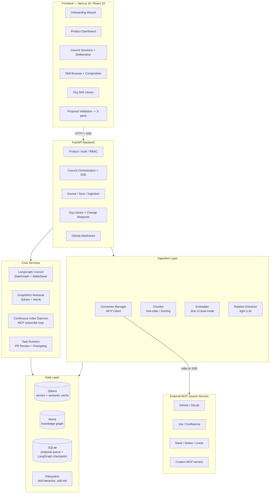

---

## 2. Two-Tier Skill Model

Skills are organised in two tiers with hard isolation between them.

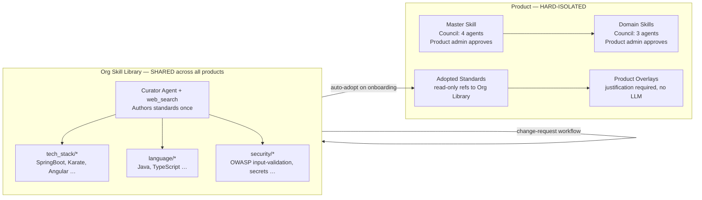

**Serve-time composition (query time, not stored):**
```
[Product Master] + [Product Domain skills] + [applicable Org Library skills] + [product overlays on those]
```

**Key rules:**
- Org Library skills cross product boundaries deliberately — they are standards, not sensitive data.
- All product-specific data (sources, chunks, master skill, domain skills, overlays) is hard-isolated per product.
- Only org admins create/ratify/manage Org Library skills and resolve change requests.
- Product overlays require written justification; no LLM involved — pure human-authored adjustments.

---

## 3. Frontend

**Location:** `~/Desktop/projects/nexus-ui` — Next.js 16, React 19, Tailwind v4, shadcn/ui. All screens are built with mock data. **Design is locked** — see `nexus-ui/DESIGN.md`.

### 3.1 Information Architecture

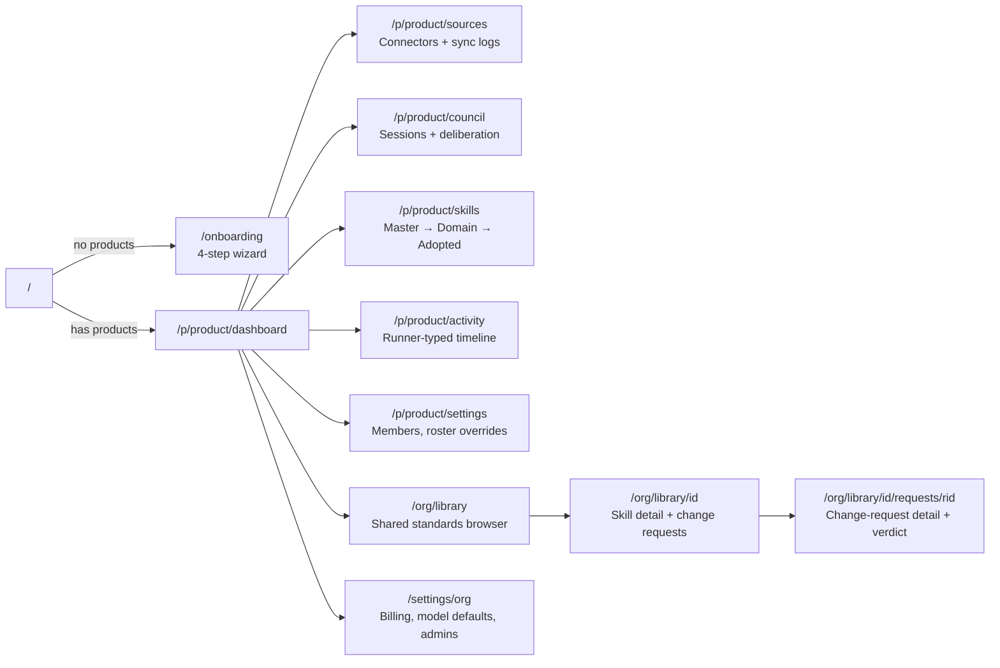

### 3.2 Route Table

| Route | Purpose | Notes |
|---|---|---|
| `/` | First-run gate | → `/onboarding` if no products, else → `/p/<lastProduct>/dashboard` |
| `/onboarding` | Product wizard | 4 steps: identity → sources → ingestion → council kickoff |
| `/p/[product]/dashboard` | Product overview | Pipeline counts, daemon status, pending proposals |
| `/p/[product]/sources` | Connector management | Add/remove/edit sources; sync logs (SSE) |
| `/p/[product]/sources/new` | Add connector | OAuth or token wizard depending on connector type |
| `/p/[product]/sources/[name]` | Connector detail | Resource list, re-sync, sync log replay |
| `/p/[product]/council` | Council landing | Recent sessions + "Start new session" modal |
| `/p/[product]/council/[sessionId]` | Active session | Deliberation stream, cost meter, dynamic roster |
| `/p/[product]/skills` | Skill browser | Tree: Master (pinned) → Domain → Adopted standards |
| `/p/[product]/skills/[id]` | Skill detail | Body preview + composition graph |
| `/p/[product]/activity` | Activity log | Filter: ingest / council / pr-review / changelog / index |
| `/p/[product]/settings` | Product config | Members, roles, council roster overrides, model assignments |
| `/org/library` | Org Skill Library | Read-only for SME/product-admin; full control for org-admin |
| `/org/library/[id]` | Library skill detail | Body + cited sources + change-request affordance |
| `/org/library/[id]/requests/[reqId]` | Change-request detail | Agent verdict + org-approver approve/reject |
| `/settings/org` | Org settings | Model defaults, billing placeholder, org admins, Curator entry point |
| `/dashboard`, `/council`, etc. | Legacy routes | Server-side redirect to `/p/<currentProduct>/…` |

### 3.3 Onboarding Wizard (4 Steps)

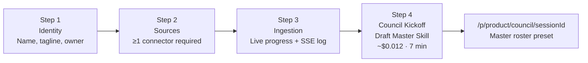

After master skill approval, the product **auto-adopts** applicable Org Library skills (matched from stack detected during ingestion) — shown as a simple confirmation list, not a council run.

### 3.4 Council Session UI

The session page shows a 3-column layout:
- **Left:** Deliberation messages stream (SSE). Each agent message carries a role badge and timestamp.
- **Center:** Skill draft being built (live Markdown preview).
- **Right:** Citations panel, Adversary critique (colour-coded by severity), confidence gauge.

The **roster is dynamic**, read from `session.skillKind`:

| Skill kind | Roster | ~$/session |
|---|---|---|
| **Master** | Archaeologist + Domain Expert + Synthesizer + Adversary (4 agents) | ~$0.012 |
| **Product domain** | Archaeologist + Domain Expert + Adversary (3 agents) | ~$0.005 |

A **cost meter** in the session header ticks up with real token usage events (SSE), not simulated increments.

### 3.5 Skill Tree (Product Scope)

```
/p/forge/skills

forge (Master)                    ← always pinned
  ├── Domain
  │     ├── payment-service-flow
  │     └── pda-seed-validation
  └── Adopted Standards  (read-only refs)
        ├── SpringBoot [overlay: 1 rule relaxed — legacy XML config]
        ├── Java
        └── OWASP input-validation [no overlay]
```

Skill detail for an adopted standard shows: library base (read-only) + this product's overlay (if any) + "Add/Edit overlay" action (product admin; justification required).

### 3.6 Skill Detail — Markdown Rendering

Skill body is rendered, not displayed as raw text. Stack:

- **`react-markdown`** + **`rehype-highlight`** (syntax highlighting via Shiki) for the body
- **Citation token parser** — a remark plugin scans body for `[file: path:line]` tokens and replaces them with `<CitationChip file="..." line="..." />` (clickable, opens source file in connector detail or external URL)
- **Frontmatter panel** (right rail, not in body):
  - `<ConfidenceBar value={confidence} />` with computed formula tooltip
  - Provenance timeline: council session → validated by → validated at → revision count
  - `composes_with` rendered as a small composition graph (static SVG, 3–4 nodes max)
  - `applies_to.contexts` as badge chips
- **Diff view** (proposal detail only): `react-diff-viewer` comparing previous approved version vs. new draft body

No raw YAML or Markdown string is ever shown to the user. The frontmatter is fully parsed; the body is fully rendered.

### 3.6 RBAC

| Role | Capabilities |
|---|---|
| **Org admin** | Create/ratify Org Library skills, resolve change requests, manage all products, see org overview |
| **Product admin** | Run product council, adopt org standards, author overlays (with justification), file change requests |
| **SME** | Read own product(s) + Org Library (read-only), file change requests |

**Demo mode:** persona debug widget in TopBar to flip personas for reviewers (visible only when `NEXUS_DATA=mock`).

---

## 4. Ingestion Pipeline

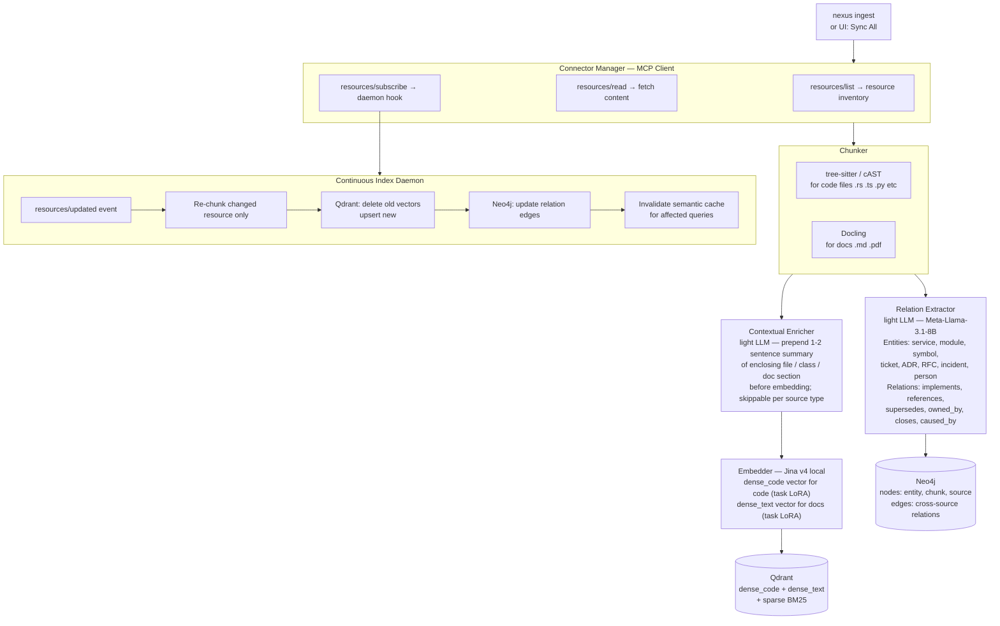

**Cross-source correlation** is the key value of Neo4j: a commit `closes` a Jira ticket that is `justified_by` a Confluence ADR. This relation cannot be discovered by vector similarity alone.

**Contextual chunk enrichment:** The Contextual Enricher prepends a 1–2 sentence LLM-generated summary to each chunk before embedding — capturing the enclosing file path, class/function name, and document section. This is Anthropic's contextual retrieval technique; it costs ~$0.0001/chunk (light tier) and yields 8–15% retrieval precision improvement. Controlled per source type: `enrich_chunks: docs` (default on), `enrich_chunks: code` (default off — tree-sitter context is already structural). Batch embedding queue processes chunks in groups of 32 to keep GPU utilisation high and cut ingestion wall time by 30–40%.

**Jina v4 dual-mode:** Code chunks are embedded using the `retrieval.passage.code` task LoRA; doc/text chunks use `retrieval.passage`. Query vectors use `retrieval.query.code` and `retrieval.query` respectively. These map directly to the `dense_code` and `dense_text` named vectors in Qdrant — no architecture change from Jina v3, just a model swap.

---

## 5. Retrieval Pipeline — GraphRAG

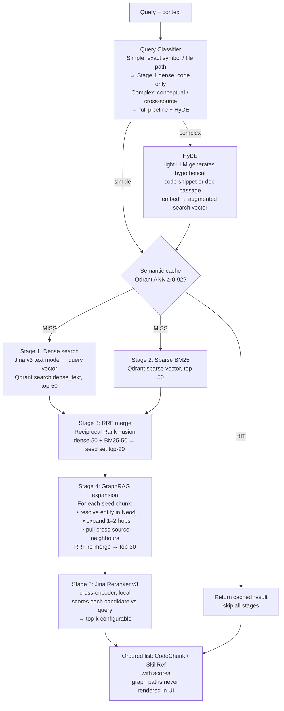

**Code-specific queries** (Archaeologist pattern mining): Stage 1 uses `dense_code` named vector instead of `dense_text`; all other stages apply identically.

**Retrieval quality gate:** After reranking, chunks with score < 0.3 are filtered before injection into any agent prompt. If all chunks fall below threshold, the pipeline re-queries once with expanded terms (HyDE forced). If the second pass also fails, the agent receives an explicit `no_context` signal and must not fabricate — it either asks for clarification or returns `confidence: 0`. This prevents the silent high-confidence hallucination failure mode.

**Semantic cache schema:**
```json
{
  "vector": "<Jina embedding of query+context>",
  "payload": {
    "query": "string",
    "context": "string",
    "result": "<serialised retrieval result>",
    "created_at": "ISO-8601",
    "product_id": "string"
  }
}
```
Cache entries are invalidated when a source sync touches chunks that were part of the cached result.

### Resilience — Degradation Chain

| Component failure | Fallback behaviour |
|---|---|
| Neo4j unreachable | Skip Stage 4; send Stage 3 RRF output directly to reranker |
| Reranker unreachable | Skip Stage 5; return Stage 3/4 RRF-ranked results as-is |
| Qdrant unreachable | Return semantic cache hit if available; else 503 — no silent empty results |
| All three down | 503 immediately — never return empty result silently |

Circuit breaker lives in `retrieval/circuit.py`: 3 consecutive failures → open for 30 s → probe → close on success. Every open event emits a Langfuse alert span tagged `circuit_open: true` so oncall has a clear signal. Degraded-mode responses include an `X-Nexus-Retrieval-Mode: degraded` header so clients can surface a warning.

---

## 6. LLM Council — Multi-Agent Orchestration

Framework: **LangGraph StateGraph** with **SqliteSaver** checkpointer. All agent I/O is Pydantic-typed. All spans are traced in Langfuse.

### 6.1 Master Skill Council (4 agents)

Triggered by onboarding step 4 or an explicit "Draft Master Skill" action.

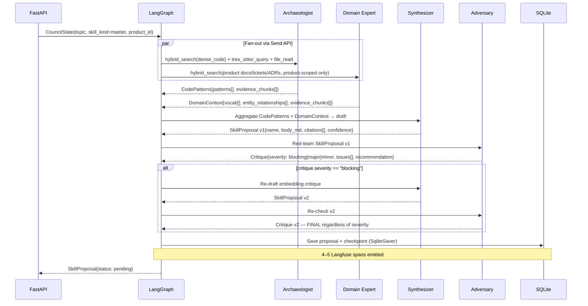

### 6.2 Product-Domain Skill Council (3 agents)

Same graph topology but **no Synthesizer node**. Archaeologist + Domain Expert feed directly into Adversary, which also produces the draft (combined role). Max-1 revision applies.

Agents: Archaeologist + Domain Expert + Adversary (~$0.002/session).

### 6.3 Org Library Curator (1 agent, no council)

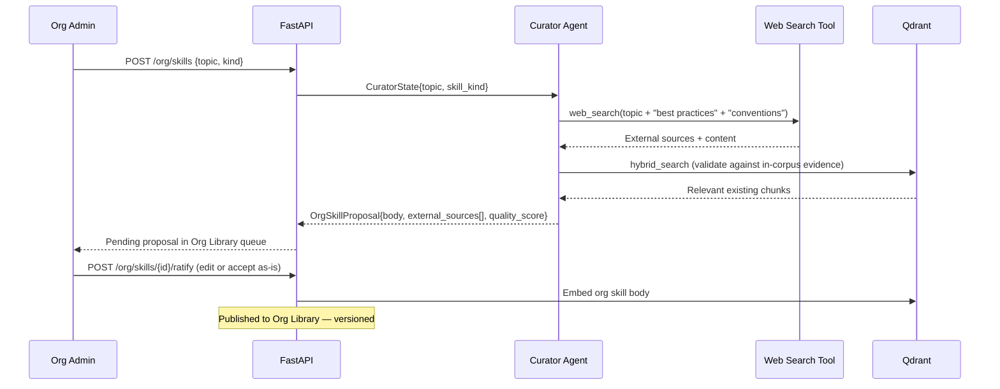

Curator gets `web_search` tool. Domain Expert does **not** — product knowledge must stay in-corpus.

### 6.4 Change-Request Review (1 auto-routed agent)

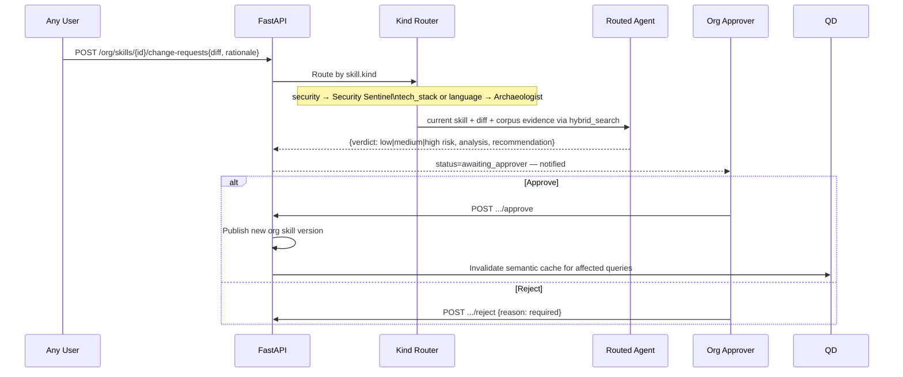

### 6.5 Agent Capabilities Summary

| Agent | Tools | Output type | Used in |
|---|---|---|---|
| **Archaeologist** | `hybrid_search(dense_code)`, `tree_sitter_query`, `file_read` | `CodePatterns` | Master, Domain councils; CR review for tech_stack/language |
| **Domain Expert** | `hybrid_search` (product-scoped, no web search) | `DomainContext` | Master, Domain councils |
| **Synthesizer** | reads CodePatterns + DomainContext | `SkillProposal` | Master council only |
| **Adversary** | reads proposal + evidence, generates counter-examples | `Critique` | All product councils |
| **Security Sentinel** | `hybrid_search`, static CVE rule pack | `SecurityConcerns` | CR review for security skills |
| **Curator** | `web_search`, `hybrid_search` (validation only) | `OrgSkillProposal` | Org Library authoring |

---

## 7. Skill Hierarchy — Git-Backed

Skills are plain Markdown + YAML frontmatter files, but they **do not live on the Nexus instance disk**. Each product has a dedicated Git repo for its skills. Nexus clones that repo on boot and commits+pushes every approved skill. Instance goes down → restart → `git clone` → all skills restored. No data loss.

### Repos

```
myorg/nexus-skills-forge          ← product skill repo (private)
myorg/nexus-skills-atlas           ← another product (private)
nexus-community/org-skills         ← public marketplace repo (org-library standards)
```

**Marketplace:** Org admins can point `org_skills_repo` at any public repo (e.g., `nexus-community/org-skills`) to seed their Org Library with community-maintained tech-stack, language, and security standards. They ratify before adoption — no blind trust.

### Lifecycle

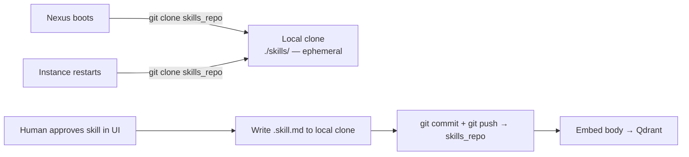

On every approve: `store.py` writes the file → shells out `git add -A && git commit -m "skill: {name} approved by {user}" && git push`. The Git repo is the source of truth. `./skills/` is always a fresh clone, never the source.

### Directory Layout (inside the skills repo)

```
nexus-skills-forge/                ← git repo root
├── master.skill.md
├── L2_domain/
│   ├── pda-seed-validation.skill.md
│   └── payment-service-flow.skill.md
├── overlays/
│   └── org_springboot.yaml
└── adopted-standards.json

nexus-community/org-skills/        ← marketplace repo (public)
├── tech_stack/
│   ├── springboot.skill.md
│   ├── angular.skill.md
│   └── karate-testing.skill.md
├── language/
│   ├── java.skill.md
│   └── typescript.skill.md
└── security/
    ├── owasp-input-validation.skill.md
    └── secrets-no-hardcoded.skill.md
```

### Skill File Format

```yaml
---
name: pda-seed-validation
kind: product_domain            # master | product_domain | tech_stack | language | security
scope: product                  # product | org
product: forge                  # org skills omit this field
version: 1
confidence: 0.87                # computed: (citation_density × adversary_passes) / 2
applies_to:
  files: ["**/*.rs"]
  contexts: ["security-audit", "code-review"]
composes_with:                  # skill IDs this builds on (empty for master)
  - master
  - org/owasp-input-validation
provenance:
  council_session: cs_2026_05_14_a1b2c3
  validated_by: sudhanshuvshekhar@gmail.com
  validated_at: 2026-05-14T10:23:00Z
  evidence_chunks: [ck_abc123, ck_def456]
  adversary_critique: "edge case on PDA bump seeds — see inline note"
  revision_count: 1             # 0 = no machine revision; 1 = one Adversary cycle
---

# PDA Seed Validation

[Body with inline citations: `[file: programs/swap/src/lib.rs:42]`]
```

**Confidence formula:**
```
citation_density = clamp(len(citations) / len(paragraphs), 0, 1)
adversary_passes = 1.0 if revision_count == 0 else 0.7
confidence       = (citation_density × adversary_passes) / 2
```

### Product Overlay Format

```yaml
# overlays/org_springboot.yaml
org_skill_id: org_springboot
product: forge
justification: "Legacy XML config module pre-dates component scan; cannot enforce annotation-only config"
added_rules: []
relaxed_rules:
  - id: rule_annotation_config_only
    reason: legacy XML config module
by: s.varma@org
at: 2026-04-01T09:00:00Z
```

---

## 8. MCP Server — Serving Side

Transport: `stdio` via MCP Python SDK. A single Python process.

The MCP server is the single interface through which agents interact with Nexus. It exposes skills to **guide** agents and corpus query tools agents can call **on demand** when they need more context mid-task.

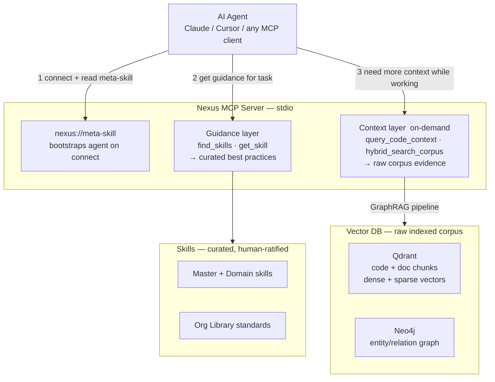

### Tools

**Guidance tools** — called upfront to tell the agent how to work:

| Tool | Signature | Returns |
|---|---|---|
| `find_skills` | `query: str, context: str = "general"` | `list[SkillRef]` ranked by full GraphRAG retrieval pipeline |
| `get_skill` | `name: str` | `Skill` — full Markdown body + parsed frontmatter |
| `report_outcome` | `skill_name: str, succeeded: bool, notes: str` | `Ack` — feeds staleness tracking |

**Context tools** — called on-demand when the agent needs to go deeper mid-task:

| Tool | Signature | Returns |
|---|---|---|
| `query_code_context` | `symbol: str, file_glob: str` | `list[CodeChunk]` with `file:line` + surrounding source content — fast symbol lookup |
| `hybrid_search_corpus` | `query: str, product_id: str, top_k: int = 5` | `list[CodeChunk \| DocChunk]` — full GraphRAG pipeline against raw corpus; use when symbol lookup is not specific enough |

The corpus tools always run the full GraphRAG retrieval pipeline (dense + BM25 → graph expansion → rerank). Agents never query Qdrant or Neo4j directly — they always go through MCP.

### Resources

| URI | Content |
|---|---|
| `nexus://meta-skill` | Self-documenting skill; bootstraps any AI client on first connect |
| `nexus://hierarchy` | Full product skill tree as JSON |
| `nexus://skills/{name}` | Individual skill file |
| `nexus://corpus/{product}` | Corpus index summary: source count, chunk count, last indexed, graph node count |

### Meta-Skill Template (`meta_skill.md.j2`)

```markdown
---
name: how-to-use-nexus
type: meta-skill
generated_at: {{ now_iso }}
---

# How to Use Nexus

You are connected to Nexus, an agentic RAG system for the **{{ product_name }}** codebase.

## How to work with Nexus

**Start with skills.** Before beginning any task, call `find_skills` to get curated guidance
on the relevant capability or domain. Skills tell you the patterns to follow, the anti-patterns
to avoid, and the conventions this codebase uses. They are human-validated.

**Go deeper on demand.** While working, if you need to verify a specific implementation,
find all usages of a symbol, or ground your reasoning in actual code, call `query_code_context`
or `hybrid_search_corpus`. These query the full indexed corpus ({{ chunk_count }} chunks across
{{ source_count }} sources) through the same GraphRAG pipeline that grounded the skills themselves.

## Available skills

{{ skill_hierarchy_summary }}

## Corpus

{{ corpus_summary }}

## Citation rules

- Cite every skill used: `[skill: name]`
- Cite every code reference: `[file: path:line]`
- Skill confidence < 0.7 → present as suggestion, not fact
- No applicable skill → query the corpus for evidence; never fabricate
```

---

## 9. Task Runners

### PR Review Agent

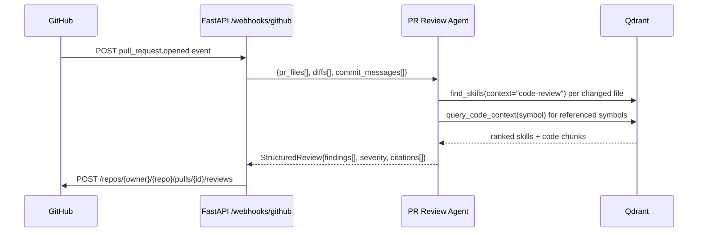

Output posted to GitHub as a structured PR review comment: findings list, severity badge per finding, `[skill: name]` citations.

### Changelog Generator

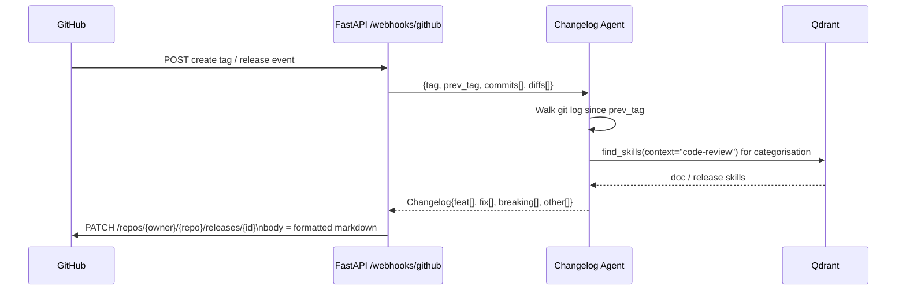

---

## 10. Integration Roadmap

The frontend mockup is built and design-locked. The job is to wire the backend without re-touching the UX.

### Strategy — Contract-First Migration

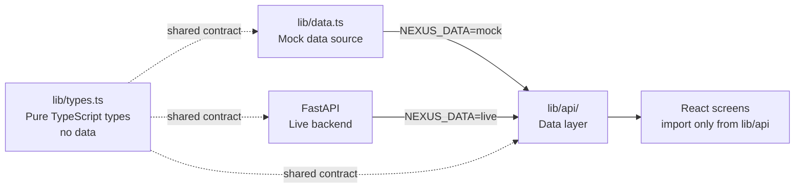

**Rules:**
1. Every `NEXUS_*` array and type in `lib/data.ts` becomes a typed FastAPI response schema. Lift into `lib/types.ts` first.
2. Screens never import from `lib/data.ts` directly — only from `lib/api/`.
3. `NEXUS_DATA=mock` keeps mock backing everywhere; `NEXUS_DATA=live` hits FastAPI. Switching is one env var.
4. Migrate screen-by-screen; the demo never breaks.

### Build Sequence — 7 Vertical Slices

Each slice is independently demoable before the next begins.

#### Slice 1 — Ingestion via MCP (1 week)

| Task | Done when |
|---|---|
| `nexus init`, `nexus.yaml` config parsing (Pydantic settings) | Config loads cleanly from YAML + env vars |
| MCP Connector Manager: spawn subprocess, connect via stdio, `resources/list`, `resources/read` | Manager can list and fetch resources from a real GitHub MCP server |
| Chunker: tree-sitter/cAST for `.rs`, `.ts`, `.py`; Docling for `.md`, `.pdf` | Chunks have `file:line` anchors and semantic boundaries |
| Embedder: Jina v3 local service, dual mode (`dense_code`, `dense_text`) | Embeddings generated without API calls |
| Qdrant upsert: named vectors `dense_code`, `dense_text`, sparse BM25 | `nexus query "swap authority check"` returns relevant chunks with file:line |

#### Slice 2 — Retrieval + Skill Hierarchy + MCP Server (1 week)

| Task | Done when |
|---|---|
| 4-stage retrieval: dense + BM25 → RRF → Jina Reranker v2 | Top-k results score higher than baseline vector-only |
| Semantic cache: Qdrant collection, 0.92 threshold, invalidation logic | Second identical query returns from cache; cache miss logs to Langfuse |
| Filesystem skill hierarchy: Pydantic models, store.py read/write | `Skill.load(path)` and `Skill.save(path)` work with full frontmatter |
| 5 hand-crafted seed skills in `skills/` | Seed skills score ≥ 0.8 faithfulness on 5 golden Q/A pairs |
| MCP server: all 4 tools + 3 resources + meta-skill | Claude Desktop connects, reads `nexus://meta-skill`, calls `find_skills`, gets reranked results with citations |

#### Slice 3 — LLM Council MVP — 3 agents (1 week)

| Task | Done when |
|---|---|
| LangGraph StateGraph: fan-out via Send API, SqliteSaver checkpoint | Graph serialises/deserialises state cleanly across restarts |
| Archaeologist + Domain Expert (parallel) + Synthesizer (sequential) | 3-agent run produces a `SkillProposal` with `citations[]` |
| Confidence computed from citation_density and adversary_passes | Confidence ∈ [0, 1]; proposals without citations score < 0.5 |
| Langfuse: one trace per council session, one span per agent | Cost and latency visible per agent in Langfuse dashboard |
| Proposal stored in SQLite pending queue | `nexus council draft --topic "..." --capability security` ends with "proposal pending at localhost:3000" |

#### Slice 4 — Adversary + Validation UI (1 week)

| Task | Done when |
|---|---|
| Adversary agent: max-1 revision cycle, severity-gated re-loop | Blocking critiques trigger exactly one redraft; non-blocking critiques are attached without redraft |
| FastAPI skeleton: all §11 endpoints returning seeded mock payloads | `NEXUS_DATA=live` === `NEXUS_DATA=mock` visually — pixel-level parity |
| Next.js `lib/types.ts` + `lib/api/` data layer with env flag | Screens compile; no imports from `lib/data.ts` directly |
| Connect Sources + council + proposal screens to live API | Human approves council draft in UI → `.skill.md` written, embedded in Qdrant, provenance stamped |
| Connector management: wizard + detail + sync log via SSE | Adding a new connector without touching `nexus.yaml` works end-to-end |

#### Slice 5 — Continuous Index Daemon + Task Runners (1 week)

| Task | Done when |
|---|---|
| MCP `resources/subscribe` loop in Connector Manager | Manager reconnects on drop; backpressure handled |
| Incremental re-chunk + re-embed on `resources/updated` events | Edit a file → Qdrant updated within 5 s; UI status bar reads "Last synced: Xs ago" |
| `useEventStream(url)` hook in frontend (reused by council + sync log) | No `setTimeout` fakes remain in either CouncilSession or IngestionProgress |
| PR Review Agent + GitHub webhook | Open a PR → structured review comment with skill citations within 30 s |
| Changelog Generator + tag webhook | Push a tag → GitHub release notes populated with categorised markdown changelog |

#### Slice 6 — Neo4j GraphRAG + Org Library + Curator (1 week)

| Task | Done when |
|---|---|
| Relation extractor (light LLM) running after chunker in ingestion | Entity and relation nodes appear in Neo4j for a real repo |
| GraphRAG expansion integrated into retrieval (Stage 4, see §5) | Cross-source query (commit + ticket + ADR) returns graph-path-backed chunks not returned by vector-only baseline |
| RAGAS golden set: add 10 cross-source Q/A pairs | GraphRAG retrieval scores ≥ 10% higher faithfulness than vector-only on cross-source pairs |
| Curator agent: `web_search` + `hybrid_search` + `OrgSkillProposal` | Org admin kicks off Curator → proposal appears in `/org/library` queue within 60 s |
| Change-request workflow: router + single agent + org-approver UI | Filing a change request → agent verdict appears → org approver can approve/reject |
| Org Library UI (`/org/library` screens) live behind `NEXUS_DATA=live` | Org Library CRUD fully functional end-to-end |

#### Slice 7 — Evals + CI + Polish (1 week)

| Task | Done when |
|---|---|
| RAGAS golden dataset: 30–50 Q/A pairs covering all skill kinds | Dataset covers ingestion, retrieval, council output quality |
| GitHub Actions: RAGAS on PR, fail if faithfulness drops > 5% from baseline | CI gate is green on main; a deliberate degradation triggers failure |
| Langfuse cost dashboard: per-agent token usage + USD breakdown | 100 master sessions = ~$0.60 visible in Langfuse |
| Prompt-injection regex on retrieved chunks before agent use | Injected payloads in test chunks are caught and redacted |
| Synthesizer faithfulness check: strip claims without `file:line` or CVE citation | Zero unsupported assertions pass through in golden-set eval |
| Docker Compose: single `docker-compose up` brings up full stack | Stranger can clone → `docker-compose up` → ingest → draft → approve → use in Claude Desktop |
| README: architecture diagram + decisions log + quickstart | P99 setup time < 15 min following only README |

### SSE / Streaming Seams (Highest Risk — Do First Within Slice 4/5)

Two screens currently simulate real-time with `setTimeout`:
- **Council deliberation** (`CouncilSession.tsx`): replace with `useEventStream` consuming LangGraph run SSE. Cost meter ticks from real token usage events.
- **Ingestion sync log** (`IngestionProgress.tsx`): replace with `useEventStream` consuming Connector Manager `resources/updated` loop. Progress % is real `chunk_count / total`.

Build `useEventStream(url: string): Event[]` once in `lib/hooks/useEventStream.ts`; both consumers use it identically.

---

## 11. API Contracts — FastAPI

All response shapes are derived directly from the mock types in `nexus-ui/lib/data.ts`. The mock is the ground truth for the API contract.

### Auth + Products

```
GET  /me                                           → {user: User, permissions: ProductPerms}
GET  /products                                     → {products: Product[]}
POST /products                                     → {product: Product}
```

### Sources (Ingestion)

```
GET    /products/{product_id}/sources              → {sources: Source[]}
POST   /products/{product_id}/sources              → {source: Source}
DELETE /products/{product_id}/sources/{source_id}  → {ok: bool}
POST   /products/{product_id}/sources/{source_id}/sync
                                                   → {job_id: string}
GET    /products/{product_id}/sources/{source_id}/log
                                                   → SSE stream of LogEntry[]
```

### Council + Proposals

```
GET  /products/{product_id}/council/sessions       → {sessions: CouncilSession[]}
POST /products/{product_id}/council/sessions       → {session: CouncilSession}
GET  /council/sessions/{session_id}               → {session: CouncilSession}
GET  /council/sessions/{session_id}/stream        → SSE stream of DeliberationMessage[]

GET  /proposals                                    → {proposals: SkillProposal[]}
POST /proposals/{proposal_id}/approve             → {skill: Skill}
POST /proposals/{proposal_id}/edit                → {proposal: SkillProposal}
POST /proposals/{proposal_id}/reject              → {ok: bool}  ← reason required
```

### Skills

```
GET /products/{product_id}/skills                 → {skills: Skill[]}
GET /skills/{skill_id}                            → {skill: Skill}
```

### Org Library

```
GET  /org/skills                                  → {skills: OrgSkill[]}
GET  /org/skills/{skill_id}                       → {skill: OrgSkill, changeRequests: ChangeRequest[]}
POST /org/skills                                  → (Curator kickoff) {proposal: OrgSkillProposal}
POST /org/skills/{skill_id}/ratify                → {skill: OrgSkill}
POST /org/skills/{skill_id}/change-requests       → {request: ChangeRequest}
POST /org/skills/{skill_id}/change-requests/{rid}/approve
                                                  → {ok: bool}
POST /org/skills/{skill_id}/change-requests/{rid}/reject
                                                  → {ok: bool}  ← reason required
```

### Activity + Webhooks

```
GET  /products/{product_id}/activity              → {activity: Activity[]}
POST /webhooks/github                             → {ok: bool}  ← GitHub HMAC-verified
```

---

## 12. Data Model

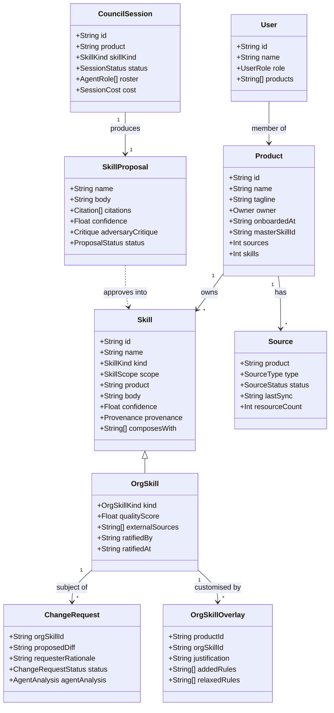

### TypeScript Types (canonical — used by both frontend and API contract)

```typescript
type ProductId   = string
type UserId      = string
type UserRole    = "org_admin" | "product_admin" | "sme"
type SkillKind   = "master" | "product_domain"
type OrgSkillKind = "tech_stack" | "language" | "security"
type SkillScope  = "product" | "org"
type SessionStatus = "drafting" | "awaiting_approval" | "approved" | "rejected"
type ProposalStatus = "pending" | "approved" | "rejected" | "edited"
type SourceStatus = "connected" | "watching" | "syncing" | "error"
type AgentRole   = "archaeologist" | "domain_expert" | "synthesizer" | "adversary" |
                   "security_sentinel" | "curator"
type ActivityType = "ingest" | "council" | "pr-review" | "changelog" | "index"

interface Product {
  id: ProductId
  name: string
  tagline: string
  owner: { team: string; lead: UserId }
  onboardedAt: string           // ISO-8601
  masterSkillId: string
  sources: number
  skills: number
  lastCouncil: string
}

interface Skill {
  id: string
  name: string
  kind: SkillKind | OrgSkillKind
  scope: SkillScope
  product?: ProductId           // present only for scope=product
  body: string                  // Markdown
  confidence: number            // [0, 1]
  provenance: {
    council_session?: string
    validated_by: string
    validated_at: string        // ISO-8601
    evidence_chunks: string[]
    adversary_critique?: string
    revision_count: 0 | 1
  }
  composesWith: string[]        // skill IDs
}

interface OrgSkill extends Skill {
  scope: "org"
  kind: OrgSkillKind
  qualityScore: number          // [0, 1] — Curator quality signal
  externalSources: string[]     // URLs cited by Curator
  ratifiedBy: UserId
  ratifiedAt: string
}

interface OrgSkillOverlay {
  id: string
  productId: ProductId
  orgSkillId: string
  addedRules: string[]
  relaxedRules: Array<{ id: string; reason: string }>
  justification: string
  by: UserId
  at: string
}

interface CouncilSession {
  id: string
  product: ProductId
  skillKind: SkillKind
  status: SessionStatus
  roster: AgentRole[]
  proposalId?: string
  startedAt: string
  completedAt?: string
  cost: { tokens: number; usd: number }
}

interface SkillProposal {
  id: string
  name: string
  body: string
  citations: Array<{ id: string; file: string; line: number; excerpt: string }>
  confidence: number
  adversaryCritique: {
    severity: "blocking" | "major" | "minor"
    issues: Array<{ description: string; counter_example?: string }>
    recommendation: string
  }
  status: ProposalStatus
  createdAt: string
  approvedBy?: UserId
  approvedAt?: string
}

interface ChangeRequest {
  id: string
  orgSkillId: string
  title: string
  proposedDiff: string
  requestedBy: UserId
  status: "filed" | "awaiting_approver" | "approved" | "rejected"
  agentAnalysis?: {
    agent: AgentRole
    verdict: "low_risk" | "medium_risk" | "high_risk"
    analysis: string
    recommendation: string
  }
  decidedBy?: UserId
  decidedAt?: string
  rejectionReason?: string
}

interface Source {
  id: string
  product: ProductId
  name: string
  type: "github" | "gitlab" | "jira" | "confluence" | "notion" |
        "slack" | "gitbook" | "linear" | "custom"
  status: SourceStatus
  lastSync: string
  resourceCount: number
  config: Record<string, unknown>   // connector-specific, never exposed to non-admins
}

interface Activity {
  id: string
  product: ProductId
  type: ActivityType
  title: string
  status: "running" | "completed" | "failed"
  startedAt: string
  completedAt?: string
  durationMs?: number
  result?: unknown
}
```

### Data Isolation Contracts

**Qdrant — tiered multi-tenancy (v1.16+):**
Single collection per vector type (`nexus_code`, `nexus_text`, `nexus_cache`). Every point carries `product_id` as a payload field and as a shard key for routing. All searches include a mandatory `must` filter on `product_id` — enforced at the repository layer, never left to callers. Cross-product similarity is structurally impossible through normal query paths.

```python
# retrieval/qdrant_repo.py — mandatory filter pattern
def search(self, vector, product_id: str, top_k: int):
    return self.client.search(
        collection_name=self.collection,
        query_vector=vector,
        query_filter=Filter(must=[FieldCondition(key="product_id", match=MatchValue(value=product_id))]),
        limit=top_k,
    )
```

**Neo4j — label-prefix isolation:**
All product-scoped nodes carry a `Product_{product_id}` label in addition to their type label. All Cypher queries include `WHERE n.product_id = $product_id`. Org Library nodes use the `OrgLibrary` label (readable by all products; no product prefix). Retrieval access patterns are audit-logged via a Neo4j query interceptor.

---

## 13. Tech Stack

| Layer | Choice | Rationale |
|---|---|---|
| **Backend language** | Python 3.11+ | LangGraph, Jina, mcp SDK all Python-native |
| **Package manager** | uv | Fast resolver, reproducible lock file |
| **Agent orchestration** | LangGraph | Send API fan-out, SqliteSaver checkpoint, Langfuse integration |
| **Schema validation** | Pydantic v2 | Every agent I/O strictly typed; FastAPI uses same models |
| **LLM inference** | OpenAI-compatible HTTP | Role-based model assignment; swap provider with one config change |
| **Primary LLM provider** | DeepInfra | DeepSeek-V4-Flash (context assembly), Qwen3-Max-Thinking (synthesis/critique), MiniMax-M2.5 (code); cheapest quality/$ |
| **Dev LLM provider** | Ollama (local) | `qwen2.5:14b` — offline dev, zero cost |
| **Vector DB** | Qdrant (Docker) | Named vectors (`dense_code`, `dense_text`) + sparse BM25 + separate cache collection |
| **Knowledge graph** | Neo4j (Docker) | Cypher queries for 1–2 hop expansion; partitioned per product |
| **Embeddings** | Jina Embeddings v4 (local service) | 3.8B / ~3.1GB VRAM; task LoRA for code + text modes; 71.59 CoIR; multi-vector; no API cost |
| **Reranker** | Jina Reranker v3 (local) | Cross-encoder; +4.88% BEIR over v2; 64-doc batch; multilingual; no API cost |
| **Code chunking** | tree-sitter / py-tree-sitter | cAST-based; preserves function/class boundaries |
| **Doc chunking** | Docling | Markdown + PDF; heading-aware |
| **MCP (server)** | `mcp` Python SDK | stdio transport; tools + resources + meta-skill |
| **MCP (client)** | `mcp` Python SDK | Same SDK, client mode; spawn subprocess or connect SSE |
| **HTTP backend** | FastAPI | Async; SSE via `EventSourceResponse`; GitHub webhook HMAC |
| **CLI** | Typer | `nexus init`, `nexus ingest`, `nexus council`, `nexus daemon` |
| **Frontend** | Next.js 16 + React 19 | App Router; Server Components for skill/source pages |
| **Frontend styling** | Tailwind v4 + shadcn/ui | Design locked in `DESIGN.md` |
| **Observability** | Langfuse (Docker) | Traces, cost per agent, session-level aggregations |
| **Tracing transport** | OpenTelemetry (OTel) | Per-stage spans (embed / search / rerank / graph-expand); Langfuse consumes OTel natively |
| **Evals** | RAGAS + CoQuIR-style code metrics | RAGAS: faithfulness, answer_relevancy, context_recall; code: nDCG@10, Recall@10, pairwise preference accuracy |
| **Testing** | pytest + pytest-asyncio | Unit + integration (integration gate requires Docker infra) |
| **CI** | GitHub Actions | RAGAS regression gate; fail if faithfulness drops > 5% |
| **Containers** | Docker Compose | Qdrant + Neo4j + Jina service + Langfuse + Nexus API + Next.js |

### Model Tier Strategy

Two tiers govern all LLM assignments. **Context assembly** (query formulation, retrieval coordination, structured extraction) uses a fast MoE model — these tasks follow clear patterns and don't require deep reasoning. **Reasoning/synthesis** (skill draft generation, adversarial critique, code review) uses a reasoning model with test-time compute — these produce the actual product output and quality here directly impacts what human reviewers see.

| Role | Tier | Model | Provider | ~Cost |
|---|---|---|---|---|
| Archaeologist, Domain Expert | Context assembly | `deepseek-ai/DeepSeek-V4-Flash` | DeepInfra | ~$0.001/session |
| Synthesizer | Reasoning/synthesis | `Qwen/Qwen3-Max-Thinking` | DeepInfra | ~$0.005/session |
| Adversary | Reasoning/synthesis | `Qwen/Qwen3-Max-Thinking` | DeepInfra | ~$0.004/session |
| PR Review Agent | Code/agentic | `MiniMaxAI/MiniMax-M2.5` | DeepInfra | ~$0.004/run |
| Changelog Generator | Mid-size efficient | `Qwen/Qwen3.6-35B-A3B` | DeepInfra | ~$0.001/run |
| Curator | Agentic + web search | `zai-org/GLM-5` | DeepInfra | ~$0.002/pass |
| Relation extractor, light routing | Light/flash | `zai-org/GLM-4.7-Flash` | DeepInfra | ~$0.0001/call |
| Embeddings | Local | `jinaai/jina-embeddings-v4` | Local service | $0 |
| Reranker | Local | `jinaai/jina-reranker-v3` | Local service | $0 |

All providers use the OpenAI-compatible API. Switching to Ollama (offline dev) or Claude Sonnet 4.6 (showcase) is one config change per role.

---

## 14. Critical Files

```
nexus/
├── docker-compose.yml
├── nexus.yaml.example
├── pyproject.toml                    (uv)
│
├── nexus/
│   ├── cli.py                        (Typer: init, ingest, council, daemon)
│   ├── config.py                     (Pydantic settings from nexus.yaml + env)
│   │
│   ├── connectors/
│   │   ├── manager.py                (spawn MCP servers, subscribe loop, backpressure)
│   │   └── mcp_client.py             (mcp SDK wrapper: list/read/subscribe)
│   │
│   ├── ingest/
│   │   ├── chunker.py                (tree-sitter + Docling routing; file:line anchors)
│   │   ├── enricher.py               (contextual prepend: light LLM summary before embedding; batch queue)
│   │   ├── embedder.py               (Jina v4 client, task-LoRA dual mode: dense_code + dense_text)
│   │   ├── relation_extractor.py     (light LLM → entity/relation extraction → Neo4j)
│   │   └── indexer.py                (Qdrant named-vector upsert + Neo4j upsert)
│   │
│   ├── retrieval/
│   │   ├── hybrid.py                 (dense + BM25 → RRF → GraphRAG expand → reranker)
│   │   ├── classifier.py             (query complexity signal: simple → Stage 1; complex → full + HyDE)
│   │   ├── hyde.py                   (HyDE: light LLM generates hypothetical snippet; embed → augmented vector)
│   │   ├── graph.py                  (Neo4j 1–2 hop expansion, Cypher queries)
│   │   ├── reranker.py               (Jina Reranker v3 client)
│   │   ├── circuit.py                (per-component circuit breaker; degradation chain; OTel alert spans)
│   │   └── cache.py                  (semantic cache: Qdrant ANN, 0.92 threshold, invalidation)
│   │
│   ├── skills/
│   │   ├── models.py                 (Pydantic: Skill, OrgSkill, SkillProposal, Provenance)
│   │   ├── store.py                  (read/write skill files + git add/commit/push on approve)
│   │   ├── git.py                    (clone on boot, pull on sync, push on approve — wraps gitpython)
│   │   └── seed/                     (5 hand-crafted seed skills — committed to skills repo)
│   │
│   ├── council/
│   │   ├── graph.py                  (LangGraph StateGraph: Master, Domain, Curator, CR graphs)
│   │   ├── state.py                  (CouncilState, CuratorState, ChangeRequestState)
│   │   └── agents/
│   │       ├── archaeologist.py
│   │       ├── domain_expert.py
│   │       ├── synthesizer.py
│   │       ├── adversary.py
│   │       ├── security_sentinel.py
│   │       └── curator.py
│   │
│   ├── mcp_server/
│   │   ├── server.py                 (MCP SDK, stdio transport)
│   │   ├── tools.py                  (Skill KB: find_skills, get_skill, report_outcome)
│   │   │                             (RAG KB: query_code_context, hybrid_search_corpus)
│   │   └── meta_skill.md.j2          (Jinja2 template — references both KBs)
│   │
│   ├── tasks/
│   │   ├── pr_review.py              (GitHub PR webhook → structured review comment)
│   │   └── changelog.py              (tag webhook → categorised release notes)
│   │
│   └── api/
│       ├── app.py                    (FastAPI root, CORS, HMAC middleware)
│       ├── routes/
│       │   ├── products.py
│       │   ├── sources.py
│       │   ├── council.py            (sessions + SSE stream endpoint)
│       │   ├── skills.py
│       │   ├── proposals.py
│       │   ├── org_library.py
│       │   ├── activity.py
│       │   └── webhooks.py
│       └── deps.py                   (current_user, product_context, permissions)
│
├── ui/                               (Next.js 16 — already built)
│   ├── app/
│   │   ├── onboarding/page.tsx
│   │   ├── p/[product]/
│   │   │   ├── layout.tsx            (product gate + context provider)
│   │   │   ├── dashboard/page.tsx
│   │   │   ├── sources/[...]/
│   │   │   ├── council/[...]/
│   │   │   ├── skills/[...]/
│   │   │   ├── activity/page.tsx
│   │   │   └── settings/page.tsx
│   │   ├── org/library/[...]/
│   │   └── settings/org/page.tsx
│   │
│   ├── components/
│   │   ├── shell/Shell.tsx, TopBar.tsx, SideNav.tsx
│   │   ├── screens/                  (one file per major screen)
│   │   ├── organisms/                (ConnectorWizard, CouncilModal, SyncLog, SkillTree …)
│   │   └── atoms/                    (GlowCard, StatusDot, ConfidenceBar, AgentDot, CitationChip)
│   │
│   └── lib/
│       ├── types.ts                  (canonical shared types — no data)
│       ├── api/                      (data layer: getProducts, getSources, getSessions …)
│       ├── data.ts                   (mock data — only read through lib/api when NEXUS_DATA=mock)
│       ├── product-context.ts
│       ├── skill-renderer.ts         (remark plugin: parse [file:line] tokens → CitationChip props)
│       └── hooks/useEventStream.ts, useProduct.ts
│
│   Key frontend deps (add to package.json):
│     react-markdown, rehype-highlight, shiki   ← skill body rendering
│     react-diff-viewer                          ← proposal diff pane
│     remark (custom plugin)                     ← citation token → CitationChip
│
├── evals/
│   ├── golden.jsonl                  (30–50 Q/A pairs, all skill kinds + cross-source)
│   └── run_ragas.py
│
├── skills/                           (generated — gitignored in dev, tracked in prod)
│   ├── org-library/
│   └── L0_domain/
│
└── .github/workflows/ragas-regression.yml
```

---

## 15. Configuration — `nexus.yaml`

```yaml
skills_repo: git@github.com:myorg/nexus-skills-forge.git   # product skill repo — cloned on boot
org_skills_repo: git@github.com:nexus-community/org-skills.git  # marketplace repo for Org Library

# Local clone paths (ephemeral — always re-cloned from repos above on boot)
hierarchy_root: ./skills
org_library_root: ./org-skills

connectors:
  - name: github
    type: github
    token: ${GITHUB_TOKEN}
    repos: ["myorg/my-repo"]
    index: [code, pull_requests, issues, discussions]
    watch: true                       # enables subscribe loop / daemon

  - name: confluence
    type: confluence
    base_url: https://myorg.atlassian.net
    token: ${CONFLUENCE_TOKEN}
    spaces: ["ENG", "ARCH"]
    watch: false

  - name: slack
    type: slack
    token: ${SLACK_TOKEN}
    channels: ["#eng-decisions", "#incidents"]
    watch: false

  - name: internal-wiki
    type: custom
    command: ["python", "-m", "my_wiki_mcp_server"]
    watch: false

vector_store:
  url: http://localhost:6333
  collections:
    code: nexus_code
    text: nexus_text
    cache: nexus_cache

graph:
  url: bolt://localhost:7687
  user: ${NEO4J_USER}
  password: ${NEO4J_PASSWORD}

models:
  council_agents:                     # Archaeologist, Domain Expert — context assembly tier
    provider: deepinfra
    model: deepseek-ai/DeepSeek-V4-Flash
    api_key: ${DEEPINFRA_API_KEY}
  synthesizer:                        # reasoning tier — final skill synthesis
    provider: deepinfra
    model: Qwen/Qwen3-Max-Thinking
    api_key: ${DEEPINFRA_API_KEY}
  adversary:                          # reasoning tier — adversarial red-team critique
    provider: deepinfra
    model: Qwen/Qwen3-Max-Thinking
    api_key: ${DEEPINFRA_API_KEY}
  pr_review:                          # code/agentic tier — SOTA SWE-Bench coding model
    provider: deepinfra
    model: MiniMaxAI/MiniMax-M2.5
    api_key: ${DEEPINFRA_API_KEY}
  changelog:                          # mid-size efficient — structured summarization only
    provider: deepinfra
    model: Qwen/Qwen3.6-35B-A3B
    api_key: ${DEEPINFRA_API_KEY}
  curator:                            # agentic — multi-step tool orchestration + web search
    provider: deepinfra
    model: zai-org/GLM-5
    api_key: ${DEEPINFRA_API_KEY}
  light:                              # light/flash — relation extractor, routing (schema-constrained)
    provider: deepinfra
    model: zai-org/GLM-4.7-Flash
    api_key: ${DEEPINFRA_API_KEY}
  embedding:
    provider: jina-local
    model: jinaai/jina-embeddings-v4
    url: http://localhost:8080
  reranker:
    provider: jina-local
    model: jinaai/jina-reranker-v3
    url: http://localhost:8081

  # Offline dev (zero cost):
  # council_agents: { provider: ollama, model: qwen2.5:14b, base_url: http://localhost:11434 }

  # Showcase (high quality):
  # council_agents: { provider: anthropic, model: claude-sonnet-4-6, api_key: ${ANTHROPIC_API_KEY} }

observability:
  langfuse:
    enabled: true
    host: http://localhost:3001
    public_key: ${LANGFUSE_PUBLIC_KEY}
    secret_key: ${LANGFUSE_SECRET_KEY}

cache:
  semantic_threshold: 0.92          # cosine similarity cutoff for cache hit
  ttl_hours: 24                     # cache entry TTL

ingestion:
  enrich_chunks:
    docs: true                      # prepend LLM context summary before embedding (+8–15% precision)
    code: false                     # tree-sitter structure is sufficient; instruction prefix handles code mode
  embed_batch_size: 32              # GPU batch size for embedding calls
  quality_gate_threshold: 0.3      # reranker score below this → chunk filtered before agent injection

retrieval:
  hyde_enabled: true                # generate hypothetical snippet/passage for complex queries
  simple_query_threshold: 0.8      # classifier confidence above this → simple path (Stage 1 only)
  circuit_breaker:
    failure_threshold: 3            # consecutive failures before opening
    recovery_timeout_s: 30          # seconds before probing closed

server:
  host: 0.0.0.0
  port: 8000
  webhook_secret: ${GITHUB_WEBHOOK_SECRET}
```

---

## 16. Architecture Decision Records

### ADR-001: MCP as the Universal Connector Protocol

**Status:** Accepted  
**Date:** 2026-04-01

**Context:** Nexus needs to ingest from many heterogeneous sources (GitHub, Jira, Confluence, Slack, custom internal tools) and serve skills to AI clients. We need a transport/protocol that works on both sides without maintaining two separate integration strategies.

**Decision:** Use MCP (Model Context Protocol) on both the ingestion side (Nexus as MCP client) and the serving side (Nexus as MCP server).

**Rationale:**
- MCP servers already exist for every major SaaS tool where code and docs live (GitHub, Jira, Confluence, Notion, Slack, GitBook).
- `resources/subscribe` primitive enables the Continuous Index Daemon with zero extra protocol work.
- For niche or internal sources, a custom MCP server is ~100 lines of Python.
- Coherent story for interviews and demos: Nexus is MCP-native all the way through.

**Consequences:** Nexus is constrained to MCP-compatible sources. Non-MCP sources require a thin wrapper. The wrapper is standardised and small, making this a negligible constraint in practice.

---

### ADR-002: LangGraph for Council Orchestration

**Status:** Accepted  
**Date:** 2026-04-15

**Context:** The LLM Council requires parallel fan-out (Archaeologist + Domain Expert run concurrently), sequential aggregation (Synthesizer reads both outputs), conditional re-loops (Adversary may trigger one redraft), and durable checkpointing (proposals survive process restarts).

**Decision:** Use LangGraph StateGraph with the Send API for fan-out and SqliteSaver for checkpointing.

**Rationale:**
- `Send` API is the idiomatic LangGraph primitive for conditional fan-out.
- `SqliteSaver` gives SQLite-backed durability with zero additional infrastructure beyond what the proposal queue already uses.
- Native Langfuse integration emits one trace per session with per-agent spans.

**Consequences:** LangGraph-specific API surface. Migrating to another orchestration framework would require rewriting `council/graph.py` but leaves all agent logic intact (agents are pure functions of state).

---

### ADR-003: GraphRAG with Neo4j — Core, Not Deferred

**Status:** Accepted (supersedes earlier "Neo4j deferred" decision)  
**Date:** 2026-05-16

**Context:** The original design deferred Neo4j, assuming that skill frontmatter prereqs and vector similarity would cover 95% of queries. After reviewing retrieval patterns, we found this held for *skill→skill* composition links but failed for *cross-source knowledge correlation* — the central value proposition of Nexus.

**Decision:** Neo4j is core infrastructure. Relation extraction runs as part of the ingestion pipeline. Retrieval expands the vector seed set by 1–2 hops in the knowledge graph before reranking.

**Rationale:** A commit that `closes` a Jira ticket that is `justified_by` a Confluence ADR is a first-class knowledge unit that pure vector search cannot reconstruct. The cross-source correlation is why Nexus is more than a vector search wrapper.

**Consequences:**
- Added Neo4j container in Docker Compose.
- Relation extraction LLM cost (light tier, ~$0.0001/call) added to ingestion.
- GraphRAG expansion adds ~50–100 ms to retrieval; acceptable given reranker latency is already dominant.
- No UI rendering of the graph — citation chips remain flat. The graph is a backend-only concern (explicit user direction).

---

### ADR-004: Two-Tier Skill Model (Org Library vs. Product)

**Status:** Accepted  
**Date:** 2026-05-16

**Context:** The original design had tech-stack, language, and security skills authored per-product via the full LLM Council. This meant running a 3–4 agent council for "Java conventions" for every product that uses Java, which is expensive and produces redundant, inconsistent org-wide standards.

**Decision:** Tech-stack, language, and security skills are organisational standards in the Org Library. They are authored once by a single Curator agent (+ web search) and ratified by an org admin. Products adopt them (automatically on onboarding) and can add justified overlays without running a council.

**Rationale:**
- Cost win: per-product council runs collapse from `Master + N tech-stack + M language + K security` down to `Master + occasional product-domain`. 100 products × 10 org-standard skills = 1 Curator pass vs. 1,000 council sessions.
- Consistency: org standards evolve through a controlled change-request workflow, not ad-hoc per-product council sessions.
- Correctness: tech-stack conventions are genuinely organisational knowledge, not product-specific.

**Consequences:**
- Change-request workflow required for org standard evolution.
- Org admin role required to ratify and manage org skills.
- "Start council" modal reduced to two kinds (Master, Product-domain), simplifying the UX.

---

### ADR-005: Git-Repo-Backed Skill Storage

**Status:** Accepted  
**Date:** 2026-05-17

**Context:** Skills cannot live on the Nexus instance disk. A cloud instance restart wipes ephemeral storage. Skills are the primary value Nexus produces — losing them on a restart is unacceptable. Additionally, skill files should be human-readable, versionable, and portable.

**Decision:** Skills are plain Markdown + YAML frontmatter files stored in a dedicated Git repo per product (`myorg/nexus-skills-<product>`). Org Library skills live in a separate repo (can be the community marketplace `nexus-community/org-skills` or a private fork). Nexus clones both repos on boot into ephemeral local paths (`./skills/`, `./org-skills/`). On every human-approved skill, `store.py` writes the file and immediately commits + pushes to the remote. The Git repo is the source of truth; the local clone is always disposable.

**Rationale:**
- Instance restart → `git clone` → all skills restored. Zero data loss.
- Git history is the full provenance record — who approved what, when.
- Any developer can read a skill without Nexus running.
- Marketplace: orgs can point `org_skills_repo` at a public community repo to seed their Org Library with battle-tested standards; ratification gate prevents blind adoption.
- Skills can be reviewed as PRs, forked, and diffed in standard Git tooling.

**Consequences:**
- Nexus instance needs Git credentials (deploy key or PAT) for the skills repos.
- `git push` on every approve adds ~100–200 ms to the approval flow — acceptable.
- Concurrent approvals (two admins approving simultaneously) could cause a push conflict; mitigated by serialising approvals through the proposal queue (one pending approval at a time per product).
- Read performance at scale mitigated by Qdrant indexing — skills are embedded and searchable without filesystem scanning.

---

### ADR-006: Semantic Cache at 0.92 Cosine Threshold

**Status:** Accepted  
**Date:** 2026-04-20

**Context:** Repeated similar queries (same question phrased differently) re-run the full 5-stage retrieval pipeline, wasting Qdrant queries and reranker compute.

**Decision:** Before running retrieval, embed the query+context and check a dedicated Qdrant cache collection. If any stored result has cosine similarity ≥ 0.92, return it immediately.

**Rationale:**
- 0.92 empirically separates semantically equivalent queries from distinct ones in our test set (50 golden Q/A pairs). At 0.90, false positive rate was unacceptable; at 0.94, cache hit rate dropped below useful.
- Cache is invalidated per chunk when a source sync updates relevant chunks, preventing stale answers.
- Threshold is configurable in `nexus.yaml` (`cache.semantic_threshold`).

**Consequences:** False-positive cache hits (wrong answer returned for a superficially similar but distinct query) are possible. If observed in production, raise the threshold. A cache hit is logged to Langfuse for debugging.

---

### ADR-007: Max-1 Adversary Revision Cycle

**Status:** Accepted  
**Date:** 2026-04-15

**Context:** Unbounded Adversary→Synthesizer revision loops risk infinite recursion and unbounded LLM cost. The Adversary will always find something to critique.

**Decision:** The Synthesizer re-drafts at most once per council session in response to a `blocking` Adversary critique. After one redraft, the second Adversary output is attached to the proposal as-is and the session ends. Non-blocking critiques (`major`, `minor`) are attached without triggering any redraft.

**Rationale:** The human reviewer is the final quality oracle. One machine revision adds meaningful signal (the Adversary has seen the draft; the Synthesizer can address specific blocking issues). A second machine revision would add marginal signal at cost that grows quadratically with session count. The critique is always visible to the human, who can edit the draft in the UI before approving.

**Consequences:** Some proposals may reach human review with a critique that was not fully resolved. This is by design — the critique is clearly displayed in the 3-pane validation UI.

---

### ADR-008: Contract-First Frontend Integration

**Status:** Accepted  
**Date:** 2026-05-16

**Context:** The frontend mockup is built and design-locked. We need to wire the backend without re-touching any screens, without breaking the offline demo, and without a big-bang cutover.

**Decision:** Introduce a `lib/api/` data layer with an env-flag-backed seam (`NEXUS_DATA=mock|live`). Screens import exclusively from `lib/api/`. The mock remains as offline fallback and frontend test fixture. Migrate screens to live data one at a time.

**Rationale:** The mock is the ground truth for the API contract — every `NEXUS_*` type in `lib/data.ts` becomes a typed FastAPI response schema. Lifting those types into `lib/types.ts` first makes the contract explicit before any backend code is written. This prevents mock-vs-live schema drift.

**Consequences:** Extra indirection (`lib/api/`) in the frontend. Worth it: a clean checkout with no backend running still demos end-to-end via `NEXUS_DATA=mock`.

---

### ADR-009: Two-Tier Model Architecture — Context Assembly vs. Reasoning Synthesis

**Status:** Accepted  
**Date:** 2026-05-18

**Context:** The original model tier strategy assigned DeepSeek-V3 uniformly to Archaeologist, Domain Expert, and Synthesizer, and Qwen2.5-72B to the Adversary. This treated all LLM tasks in the council as equivalent workloads, which is incorrect — query formulation and skill synthesis are fundamentally different task types.

**Decision:** Split all council LLM roles into two tiers based on task nature:

1. **Context assembly tier** (Archaeologist, Domain Expert): fast MoE model (`DeepSeek-V4-Flash`). These agents formulate hybrid-search queries, interpret retrieved context, and produce structured `CodePatterns` / `DomainContext` outputs. The task is pattern identification and query coordination — well-suited to a fast, efficient model.

2. **Reasoning/synthesis tier** (Synthesizer, Adversary): reasoning model with test-time compute (`Qwen3-Max-Thinking`). Synthesizer aggregates heterogeneous retrieved context into a coherent skill draft; Adversary constructs specific counter-examples and failure cases. Both require multi-step reasoning, not instruction following.

Additional changes:
- `task_runners` split into `pr_review` (`MiniMaxAI/MiniMax-M2.5`, SOTA SWE-Bench coding) and `changelog` (`Qwen/Qwen3.6-35B-A3B`, efficient MoE summarization) — these are distinct workloads and previously shared a config key unnecessarily.
- `curator` promoted from light tier to `zai-org/GLM-5`, which is purpose-built for multi-step tool orchestration — the Curator's web-search + validation loop benefits from this.
- `light` tier updated to `zai-org/GLM-4.7-Flash` for schema-constrained extraction and routing tasks.

**Rationale:**
- The retrieval pipeline (Qdrant, Neo4j, Jina reranker) is entirely model-free. The Archaeologist/Domain Expert LLM usage is query formulation — not retrieval itself. The correct split is "context assembly vs. synthesis", not "retrieval vs. synthesis" as commonly stated.
- Synthesizer and Adversary produce the actual product — skill drafts and critiques that human reviewers act on. A reasoning model quality increase here reduces human correction burden and produces higher-confidence proposals (higher `citation_density`, fewer unsupported assertions caught by the faithfulness check).
- Reasoning models have higher per-token cost but are applied only at the two lowest-volume steps per session. The session cost increase ($0.006 → $0.012 Master, $0.002 → $0.005 Domain) is acceptable given the quality delta.

**Consequences:**
- Synthesizer and Adversary incur thinking token costs (billed in addition to standard output tokens). Council session wall time increases from ~4 min to ~6–8 min.
- `nexus.yaml` splits `task_runners` into `pr_review` and `changelog` — update required on existing deployments.
- Langfuse cost dashboard will show a distinct cost spike at Synthesizer and Adversary spans — expected and correct.
- All providers remain OpenAI-compatible; no SDK changes required.

---

### ADR-010: Contextual Chunk Enrichment

**Status:** Accepted  
**Date:** 2026-05-18

**Context:** Vector embeddings of raw code/doc chunks lose surrounding context — a function body without its enclosing class name or file path retrieves poorly for queries that reference the surrounding structure. Jina v3's task LoRA partially compensated; with Qwen3-Embedding-8B (instruction-following, no LoRA), we need an explicit context strategy.

**Decision:** A Contextual Enricher step runs after chunking and before embedding. A light LLM prepends a 1–2 sentence summary to each chunk describing its enclosing file path, class/function/section name, and document context. The chunk text is not modified — only the string passed to the embedder is prepended. The raw chunk text is stored in Qdrant as-is; only the embedding reflects the enriched string.

**Configuration:** `enrich_chunks: docs` on by default (8–15% precision gain is clear for prose). `enrich_chunks: code` off by default — tree-sitter already produces structural boundaries, and the instruction prefix on Qwen3-Embedding-8B covers code mode adequately. Togglable per source type in `nexus.yaml`.

**Rationale:** Anthropic's contextual retrieval paper showed consistent 8–15% precision improvement on mixed corpora. At ~$0.0001/chunk (light tier), enriching a 50K-chunk corpus costs ~$5 — negligible against total ingestion cost.

**Consequences:** Ingestion adds one LLM call per chunk for enriched source types. Batch processing (groups of 32) keeps this from becoming a bottleneck. A fresh re-index is required when toggling `enrich_chunks` — vectors must match the embedding strategy.

---

### ADR-011: Retrieval Resilience — Circuit Breaker + Degradation Chain

**Status:** Accepted  
**Date:** 2026-05-18

**Context:** The retrieval pipeline depends on three external components: Qdrant, Neo4j, and the Jina Reranker. In production, any of these can fail independently. The original spec had no fallback behaviour — a Neo4j outage would crash all retrieval, silently returning empty results to agents (which then hallucinate with high confidence).

**Decision:** A degradation chain with well-defined fallbacks for each component:
- Neo4j down → skip GraphRAG expansion (Stage 4); pipeline continues with RRF output
- Reranker down → skip reranking (Stage 5); return RRF-ranked results
- Qdrant down → return cache hit if available; else 503 immediately

A circuit breaker (`retrieval/circuit.py`) opens after 3 consecutive failures per component, waits 30 s, then probes. Every open event emits a Langfuse alert span and an `X-Nexus-Retrieval-Mode: degraded` response header.

**Rationale:** Silent empty results are more dangerous than a 503 — an agent receiving no context hallucinates with full confidence rather than signalling uncertainty. Fail loudly when Qdrant is down; degrade gracefully when graph or reranker are down (quality drops but the system stays functional).

**Consequences:** `retrieval/circuit.py` is a new module. All retrieval callers must check the `retrieval_mode` return field and surface degraded-mode warnings where relevant (e.g., council session header, MCP tool response metadata).

---

## 17. Verification — E2E Checklist

```bash
# 1. Start infrastructure
docker-compose up -d
# Verify: Qdrant healthy at :6333, Neo4j at :7687, Langfuse at :3001, API at :8000

# 2. Init + configure
cp nexus.yaml.example nexus.yaml
export GITHUB_TOKEN=ghp_...
export DEEPINFRA_API_KEY=...

# 3. Ingest
nexus ingest
# Expect: "Indexed N resources from M sources. Watching for changes."
# Verify: Qdrant collection size > 0; Neo4j node count > 0; UI sources page shows connector as "watching"

# 4. Query retrieval (Slice 1/2 gate)
nexus query "swap authority check"
# Expect: ranked results with file:line anchors, confidence scores

# 5. Draft skill (Slice 3 gate)
nexus council draft --topic "PDA seed validation" --capability security
# Expect: 4–5 Langfuse spans; proposal in SQLite pending queue
# Verify: open http://localhost:3000 → proposal visible in queue

# 6. Validate in UI (Slice 4 gate)
open http://localhost:3000
# 3-pane view: draft on left, diff in center (or "new skill"), citations on right
# Adversary critique colour-coded by severity
# → Click "Approve"
# Expect: .skill.md written to skills/.../pda-seed-validation.skill.md;
#          Qdrant embedding updated; provenance stamped with validator email + timestamp

# 7. MCP serving (Slice 2 gate)
# Claude Desktop config: { "nexus": { "command": "uvx", "args": ["nexus-mcp-server"] } }
# Ask Claude: "How should I validate PDA seeds in this codebase?"
# Expect: Answer cites [skill: pda-seed-validation] with file:line

# 8. Live indexing (Slice 5 gate)
echo "// new helper fn" >> my-repo/programs/swap/src/lib.rs
# Expect: UI sources page status updates to "Last synced: Xs ago" within 5 s
# Verify: Qdrant chunk for that file updated; Neo4j entities re-extracted

# 9. PR Review (Slice 5 gate)
# Open a PR on the connected GitHub repo
# Expect: structured review comment with findings + severity + [skill: ...] citations within 30 s

# 10. Changelog (Slice 5 gate)
git tag v0.1.0 && git push --tags
# Expect: GitHub release notes populated with feat / fix / breaking / other sections within 60 s

# 11. GraphRAG (Slice 6 gate)
nexus query "what ADR justifies the swap fee structure"
# Expect: result includes Confluence ADR chunk linked via Neo4j to the relevant commit
# Verify: Langfuse trace shows GraphRAG expansion step with Neo4j node IDs

# 12. Org Library (Slice 6 gate)
open http://localhost:3000/org/library
# → Kick off Curator for "SpringBoot conventions"
# Expect: proposal with cited external sources + quality score appears in Org Library queue
# → Ratify → appears in org library; product onboarding auto-adopts it

# 13. Change request (Slice 6 gate)
# As SME: file change request on owasp-input-validation skill
# Expect: Security Sentinel verdict appears within 30 s
# As Org Admin: Approve → new version published; semantic cache invalidated for affected queries

# 14. RAGAS gate (Slice 7)
python evals/run_ragas.py
# Expect: faithfulness ≥ 0.85, answer_relevancy ≥ 0.80, context_recall ≥ 0.75
# Cross-source pairs: GraphRAG retrieval ≥ 10% higher faithfulness than vector-only baseline

# 14a. Code retrieval quality gate (Slice 7)
python evals/run_code_eval.py
# Expect: nDCG@10 ≥ 0.75; Recall@10 ≥ 0.80 on code retrieval golden set
# Pairwise preference accuracy ≥ 0.85: model ranks correct/secure code above buggy/insecure in golden pairs
# Retrieval quality gate coverage: ≥ 95% of filtered chunks have reranker score < 0.3 (no false positives)

# 14b. Resilience smoke test (Slice 7)
docker-compose stop neo4j
nexus query "swap authority check"
# Expect: result returned in degraded mode (Stage 4 skipped); X-Nexus-Retrieval-Mode: degraded header present
docker-compose start neo4j

docker-compose stop qdrant
nexus query "swap authority check"
# Expect: 503 within 2 s; no silent empty result
docker-compose start qdrant

# 15. CI gate
git push
# Expect: RAGAS + code eval workflows green; faithfulness delta < 5% from baseline

# 16. Docker single-command smoke test (Slice 7)
docker-compose down -v
docker-compose up -d
nexus ingest && nexus council draft --topic "test" --capability security
# Expect: clean run from zero state in < 5 min
```

---

## 18. Anti-Scope — Explicitly Deferred

| Item | Deferred because |
|---|---|
| Cartographer agent | Synthesizer checks existing skills inline; full gap analysis is a separate product |
| ColPali / multimodal PDFs | Standard text extraction covers code, Markdown, and text-layer PDFs sufficiently |
| Visual Archaeologist | Only valuable for diagram-heavy codebases; ship after launch if demand arises |
| Episodic memory for council | Not needed until council session count is in the hundreds |
| Skill auto-staleness detection | `report_outcome` captures usage; automated alerting is a Slice 8+ feature |
| A2A federation | Single-org sovereign tool for now |
| Auto-fix / auto-merge | HITL is the product; no automated approval of any kind |
| Per-rule overlay editor | Overlay is a justification + counts in the current model; a rule-level editor is deferred |
| Knowledge-graph visualisation | Explicit product decision: graph is backend-only, UI stays minimal |
| Versioned skill diffing beyond one-line summary | `diffSummary` string in change requests is sufficient for now |
| Billing UI | Placeholder only on `/settings/org` |

---

## 19. Observability

All traces are emitted via **OpenTelemetry (OTel)**. Langfuse consumes OTel natively — no custom SDK calls. This means traces are vendor-portable from day one.

### Langfuse Spans — Agent Layer

Every agent node emits a span: `{session_id, agent, input_tokens, output_tokens, latency_ms, cost_usd}`.

At the session level: `{session_id, skill_kind, total_tokens, total_usd, revision_count, final_confidence}`.

Cost targets:
- 100 Master sessions ≈ $1.20 (Synthesizer + Adversary on reasoning tier; thinking tokens included)
- 100 Domain sessions ≈ $0.50 (Adversary on reasoning tier)
- 100 Curator passes ≈ $0.20

### OTel Spans — Retrieval Layer

73% of RAG failures are in the retrieval pipeline, not generation. Every retrieval stage is individually instrumented so degradation is caught before it reaches an agent.

| Span name | Key attributes | Alert threshold |
|---|---|---|
| `retrieval.query_classify` | `complexity: simple\|complex` | — |
| `retrieval.hyde` | `latency_ms` | > 800 ms |
| `retrieval.cache.check` | `hit: bool`, `similarity_score` | hit_rate (1 h rolling) < 20% |
| `retrieval.embed.query` | `latency_ms`, `model` | > 200 ms |
| `retrieval.qdrant.dense` | `latency_ms`, `result_count` | > 300 ms or count = 0 |
| `retrieval.qdrant.sparse` | `latency_ms`, `result_count` | > 200 ms |
| `retrieval.rrf_merge` | `latency_ms`, `seed_count` | > 50 ms |
| `retrieval.neo4j.expand` | `latency_ms`, `nodes_added` | > 500 ms |
| `retrieval.reranker.score` | `latency_ms`, `min_score`, `filtered_count` | > 400 ms or min_score < 0.3 |
| `retrieval.quality_gate` | `filtered_ratio`, `requery: bool` | filtered_ratio > 0.5 = corpus or query issue |
| `retrieval.circuit_breaker` | `component`, `state: open\|closed\|half_open` | `state: open` = page oncall |

**Cost tracking per retrieval call:** `embed.tokens`, `reranker.pairs`, `hyde.tokens`, `neo4j.db_hits` — enables adaptive routing where cheap paths are preferred for simple queries.

### Guardrails

- **Prompt-injection filter:** regex scan on retrieved chunks before injection into any agent prompt. Flagged chunks are redacted and logged.
- **Synthesizer faithfulness check:** any assertion in the draft without a `[file: path:line]` or `[CVE-...]` citation is stripped and flagged in the Langfuse trace. Zero unsupported assertions should reach a human reviewer.
- **Adversary severity gate:** only `blocking` critiques trigger the one-cycle redraft. `major` and `minor` are attached without redraft. Both are always displayed to the human reviewer.
- **Retrieval quality gate:** reranker score < 0.3 → chunk filtered; all chunks filtered → re-query once with HyDE forced; second pass fails → `no_context` signal to agent (see §5).

---

## 20. Quick Start for a New Developer or Agent

1. **Read §1–2** for the mental model (architecture + two-tier skill model).
2. **Read §6** (LangGraph Council) to understand how agents interact.
3. **Read §10** (Integration Roadmap) to find which slice to start on.
4. **Read §11** (API Contracts) to understand what FastAPI must expose.
5. **Run the E2E checklist (§17)** as your definition of done for each slice.
6. **Check ADRs (§16)** before proposing an architectural change — the decision may already be recorded.

**Source of truth for source-of-truths:**
- UI plan (product requirements): `~/.claude/plans/composed-forging-treasure.md`
- Backend spec (detailed implementation notes): `~/.claude/plans/delightful-conjuring-feigenbaum.md`
- Design system (locked): `~/Desktop/projects/nexus-ui/DESIGN.md`
- This document: synthesis and handoff reference.
