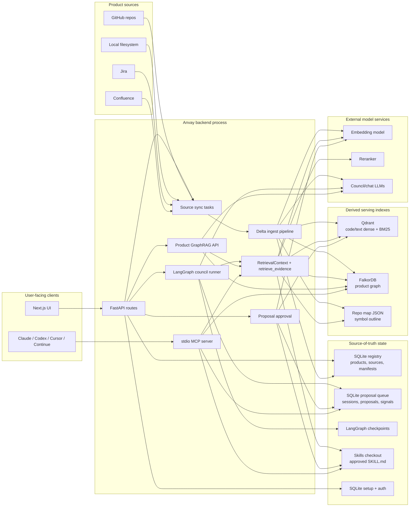
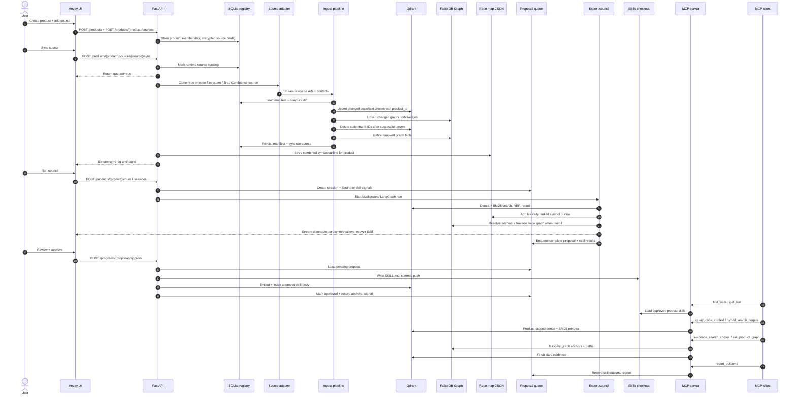
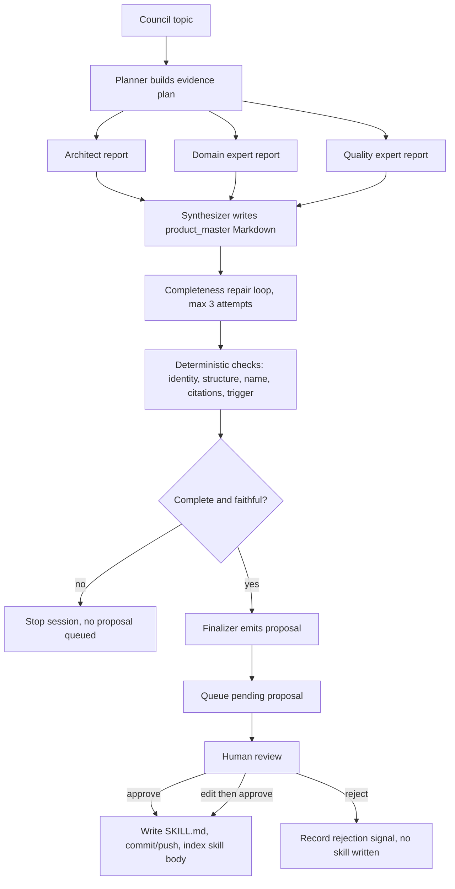

<p align="center">
  
</p>

<h1 align="center">Anvay</h1>

<p align="center">
  <strong>Give every contributor and coding agent a maintainer's map of your project.</strong>
</p>

<p align="center">
  Anvay turns repos and docs into reviewed, cited project intelligence served
  directly to AI coding tools over MCP.
</p>

<p align="center">
  <a href="./LICENSE"></a>
  
  
  
  
</p>

<p align="center">
  <a href="#quick-start">Quick Start</a>
  ·
  <a href="#mcp-usage">MCP Usage</a>
  ·
  <a href="#system-architecture">Architecture</a>
  ·
  <a href="./CONTRIBUTING.md">Contributing</a>
  ·
  <a href="./ENGINEERING.md">Engineering Spec</a>
</p>

---

Open-source projects have a context problem. New contributors do not know where
to start. Maintainers answer the same questions again and again. Docs drift.
Issues repeat. AI agents jump into code without understanding project
conventions, architecture, or blast radius.

Anvay turns that scattered project knowledge into something agents can actually
use: a product-scoped evidence index, a repo map, a dependency graph, and a
human-approved Agent Skill that captures how the project should be understood
and changed.

Point Anvay at a project, review the generated knowledge pack, then serve it to
Claude, Codex, Cursor, Continue, and any other MCP-capable coding client.

Anvay calls each isolated knowledge boundary a **product**. For open-source
users, a product is usually one project or one tightly related set of repos. The
same engine later fits internal engineering products without changing the core
model.

## Why Anvay

| Open-source pain | What Anvay gives you |
|---|---|
| New contributors ask, "where do I even start?" | Grounded onboarding answers over code, docs, repo maps, graph context, and maintainer-approved guidance. |
| AI agents miss project rules. | A reviewed `SKILL.md` loaded into coding agents before they touch code. |
| Maintainers repeat tribal knowledge. | One reusable project knowledge pack instead of copy-pasting context into every chat. |
| PRs need impact context. | Product-scoped retrieval plus graph traversal across symbols, files, and dependencies. |
| OSS launch needs public proof. | Real demos on public repos without asking companies for private IP. |

Ask Anvay:

- Where should a new contributor start?
- Which files, conventions, and tests matter for this change?
- What does this module depend on, and what might break if it changes?
- What project-specific guidance should every AI coding agent follow?
- Which docs or explanations should become a reusable contributor skill?

## What Anvay Produces

- A product-scoped retrieval index for code and docs.
- A tree-sitter repo map that helps agents understand symbols and structure.
- A knowledge graph for answering in-depth queries.
- An LLM assited, but human-approved `SKILL.md` committed to a skills repo.
- An MCP server that exposes approved skills and the project context to agents.

Current source connectors cover GitHub repositories, local filesystems, Jira,
and Confluence.

## What Anvay Guarantees

- **Product-scoped tenancy.** Every source, chunk, proposal, session, skill,
  and retrieval query carries `product_id`.
- **Human approval before publication.** Agents draft proposals; only explicit
  approval writes `SKILL.md` files.
- **Delta-safe sync.** Resync reads manifests, skips unchanged resources,
  embeds changed resources before stale chunk cleanup, and deletes removed
  resources from derived indexes.
- **Measured retrieval.** The serving path is a multi-channel evidence engine
  managed by `retrieve_evidence()`. It integrates dense + BM25 vector search,
  exact text grep, repo-map symbol outlines, graph-local path traversal, and
  approved skill memories. Results are dynamically mixed via cross-encoder
  reranking and gated by continuous evaluation metrics (e.g., faithfulness ≥ 0.85,
  nDCG@10 ≥ 0.75).
- **Portable output.** Approved skills are ordinary Agent Skills served through MCP, so
  Claude, Codex, Cursor, Continue, and other clients can consume the same product
  guidance.

See [AGENTS.md](./AGENTS.md) for contributor invariants and
[ENGINEERING.md](./ENGINEERING.md) for the formal backend spec.

## System Architecture



Anvay separates source-of-truth state from derived serving state:

| Layer | Component | Responsibility |
|---|---|---|
| API | `anvay/api/` | Product, source, council, proposal, skill, setup, auth, and dashboard routes. |
| Registry | SQLite via `anvay/registry.py` | Products, product membership, runtime sources, sync manifests, sync runs, enrichment jobs. |
| Queue | SQLite via `anvay/council/queue.py` | Council sessions, proposal rows, eval results, improvement signals. |
| Ingest | `anvay/ingest/` | Source diff, chunking, optional enrichment, embeddings, sparse vectors, graph extraction, derived-index writes, stale cleanup. |
| Retrieval | `anvay/retrieval/` | Dense + BM25 search, RRF, configured rerank, plus evidence assembly from grep, repo-map symbols, graph-local candidates, summaries, and approved skills. |
| Council | `anvay/council/` | Planner, expert fanout, synthesizer, repair, eval, finalizer, LangGraph checkpoints, SSE progress. |
| Skills | `anvay/skills/` | Agent Skills parsing, storage, provenance, approval write path, Git commit/push, approved-skill indexing. |
| MCP | `anvay/mcp_server/` | `find_skills`, `get_skill`, `query_code_context`, `grep_corpus`, `hybrid_search_corpus`, `evidence_search_corpus`, `ask_product_graph`. |
| UI | `../anvay-ui/` | Product onboarding, sync logs, council sessions, review/approval UX. |

For a code-level module map and end-to-end traces, use
[CONTRIBUTING.md](./CONTRIBUTING.md). For API contracts and data models, use
[ENGINEERING.md](./ENGINEERING.md).

## Runtime Flow



## Product Skill Lifecycle



The council emits one Markdown product skill, not JSON. Incomplete drafts never enter the
review queue. See [ENGINEERING.md](./ENGINEERING.md) for the full council
contract.

## Quick Start

Prereqs:

- Python 3.13+
- `uv`
- Docker or a reachable Qdrant
- DeepInfra API key for default cloud embeddings/reranking and council LLMs
- Sibling UI repo at `../anvay-ui/`

Install backend deps:

```bash
uv sync
```

Create local config:

```bash
cp anvay.yaml.example anvay.yaml
cp .env.example .env
```

Required `.env` values for normal development:

```bash
DEEPINFRA_API_KEY=...
ANVAY_TOKEN_KEY=...
ANVAY_SKILLS_REPO_TOKEN=...
```

Generate `ANVAY_TOKEN_KEY`:

```bash
uv run python -c "from anvay.auth.token_cipher import TokenCipher; print(TokenCipher.generate_key())"
```

Start the backend stack:

```bash
make dev
uv run uvicorn anvay.api.app:app --port 8000 --reload
```

Start the UI:

```bash
cd ../anvay-ui
npm install
npm run dev
```

Open `http://localhost:3000/setup` and connect or create the org skills repo.
Then create a product, add a GitHub source with a product service-account PAT,
sync it, run council, and review proposals.

## Configuration Notes

- `anvay.yaml` controls source defaults, retrieval backends, model endpoints,
  Qdrant settings, skills repo paths, and local model profiles.
- Product GitHub PATs are entered during onboarding and stored encrypted per
  product source. They are not global credentials.
- `ANVAY_SKILLS_REPO_TOKEN` is only for creating/cloning/pushing the org skills
  repository.
- Qdrant is derived state. SQLite manifests decide what has been successfully
  indexed.
- Optional chunk enrichment exists for code HQE and doc contextual retrieval,
  but default ingest uses fast raw dense + BM25 indexing.

## MCP Usage

Claude Desktop example:

```json
{
  "mcpServers": {
    "anvay": {
      "command": "uv",
      "args": [
        "--directory",
        "/absolute/path/to/anvay",
        "run",
        "anvay-mcp-server",
        "--product",
        "<your-product-id>"
      ],
      "env": {
        "ANVAY_CONFIG": "/absolute/path/to/anvay/anvay.yaml"
      }
    }
  }
}
```

Exposed MCP tools:

| Tool | Purpose |
|---|---|
| `find_skills` | Find approved product skills for a task/context. |
| `get_skill` | Return one approved skill body. |
| `query_code_context` | Retrieve product-scoped source context for a symbol or question. |
| `hybrid_search_corpus` | Run direct dense + BM25 + rerank corpus search. |
| `report_outcome` | Record whether a skill helped. |

## Production Deployment

Production target:

- Backend: Oracle VM, Docker Compose, Caddy TLS, FastAPI, private Qdrant.
- Frontend: Vercel running `../anvay-ui/`.
- Auth: Password/session bootstrap and session-based API auth.
- Observability: Langfuse when configured.

Use [docs/DEPLOYMENT.md](./docs/DEPLOYMENT.md) for the full runbook,
environment variables, smoke tests, backup targets, and upgrade steps.

## Development

Common checks:

```bash
uv run ruff check anvay tests evals
uv run pytest -q
```

Retrieval/eval checks are opt-in:

```bash
uv run anvay eval run --suite retrieval
uv run pytest -m eval
uv run python -m evals.run_ragas
uv run python -m evals.run_code_eval
make test-live-e2e
```

### Evaluation Gates & Thresholds

The evaluation harness enforces strict quality gates across three distinct test suites (`retrieval`, `rag`, and `code`). Pull requests and local evaluations must meet or exceed these thresholds:

| Suite | Focus | Target Metric | Required Threshold | Verification Command |
|---|---|---|---|---|
| **Retrieval** | Core search quality | Recall@10 | ≥ `0.80` | `uv run anvay eval run --suite retrieval` |
| | | Mean Reciprocal Rank (MRR) | ≥ `0.50` | |
| **RAG** | Quality & truthfulness | Faithfulness (LLM-as-a-judge) | ≥ `0.85` | `uv run python -m evals.run_ragas` |
| | | Answer Correctness (LLM-as-a-judge) | ≥ `0.80` | |
| | | Context Recall | ≥ `0.75` | |
| **Code** | Repository understanding | nDCG@10 | ≥ `0.75` | `uv run python -m evals.run_code_eval` |
| | | Recall@10 | ≥ `0.80` | |
| | | Pairwise Preference Accuracy | ≥ `0.85` | |

*Note on LLM-as-a-Judge Design:* The in-house judges evaluate faithfulness and correctness asynchronously using Chain-of-Thought (CoT) reasoning to ensure determinism and auditable output. Pairwise preference runs with position-swap bias mitigation (running matches twice swapping A/B positions).

Run retrieval evals after changes to chunking, embedding, optional enrichment,
hybrid search, reranking, or repo map generation. See
[evals/README.md](./evals/README.md) for eval harness details and
[CONTRIBUTING.md](./CONTRIBUTING.md) for contributor workflow.

## Documentation Map

| File | Use it for |
|---|---|
| [AGENTS.md](./AGENTS.md) | Non-negotiable invariants, conventions, commit checks. |
| [CONTRIBUTING.md](./CONTRIBUTING.md) | Contributor onboarding, code map, end-to-end traces, recipes. |
| [ENGINEERING.md](./ENGINEERING.md) | Formal architecture, data model, API and pipeline contracts. |
| [docs/DEPLOYMENT.md](./docs/DEPLOYMENT.md) | Production deployment and operations. |
| [../anvay-ui/DESIGN.md](../anvay-ui/DESIGN.md) | Frontend design system and IA rules. |

## License

Apache License 2.0. See [LICENSE](./LICENSE).
