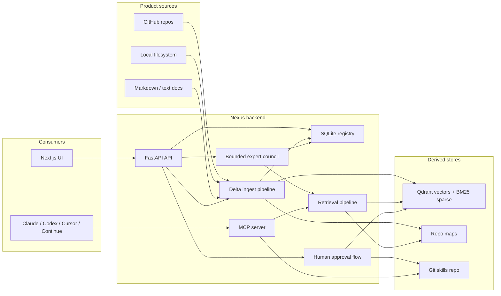
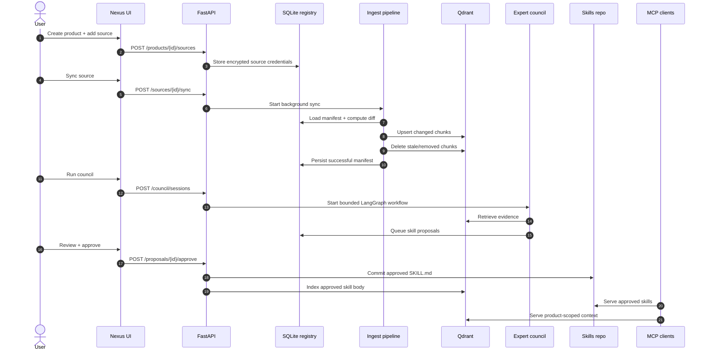
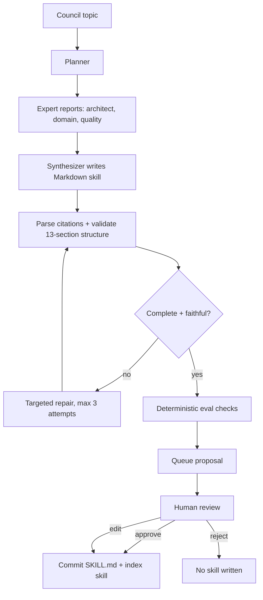

<p align="center">
  
</p>

<p align="center">
  <a href="./LICENSE"></a>
  
  
  
  
</p>

# Nexus

Nexus is a sovereign, MCP-native context engine for engineering teams. It
ingests a product's code and docs, builds a product-scoped retrieval index,
runs a bounded expert council to draft Agent Skills, requires human approval,
and serves approved skills plus raw corpus context over MCP to AI coding
clients.

Use Nexus when one org has multiple products, each with its own codebase,
docs, source credentials, approved guidance, and tenancy boundary.

## What Nexus Guarantees

- **Product-scoped tenancy.** Every source, chunk, proposal, session, skill,
  and retrieval query carries `product_id`.
- **Human approval before publication.** Agents draft proposals; only explicit
  approval writes `SKILL.md` files.
- **Delta-safe sync.** Resync reads manifests, skips unchanged resources,
  embeds changed resources before stale chunk cleanup, and deletes removed
  resources from derived indexes.
- **Measured retrieval.** The serving path is dense + BM25, reciprocal rank
  fusion, then Jina reranking. More layers require eval evidence.
- **Portable output.** Approved skills are ordinary Agent Skills directories
  served through MCP, so Claude, Codex, Cursor, Continue, and other clients can
  consume the same product guidance.

See [AGENTS.md](./AGENTS.md) for contributor invariants and
[ENGINEERING.md](./ENGINEERING.md) for the formal backend spec.

## System Architecture



Nexus separates source-of-truth state from derived serving state:

| Layer | Component | Responsibility |
|---|---|---|
| API | `nexus/api/` | Product, source, council, proposal, skill, setup, auth, and dashboard routes. |
| Registry | SQLite via `nexus/registry.py` | Products, runtime sources, sync manifests, sync runs, proposal/session metadata. |
| Ingest | `nexus/ingest/` | Source diff, chunking, optional enrichment, embeddings, sparse vectors, Qdrant writes, stale cleanup. |
| Retrieval | `nexus/retrieval/` | Dense + BM25 search, RRF merge, Jina rerank, repo map context. |
| Council | `nexus/council/` | Planner, expert fanout, synthesizer, repair, eval, finalizer, SSE progress. |
| Skills | `nexus/skills/` | Agent Skills parsing, storage, provenance, approval write path, Git commit/push. |
| MCP | `nexus/mcp_server/` | `find_skills`, `get_skill`, `query_code_context`, `hybrid_search_corpus`. |
| UI | `../nexus-ui/` | Product onboarding, sync logs, council sessions, review/approval UX. |

For a code-level module map and end-to-end traces, use
[CONTRIBUTING.md](./CONTRIBUTING.md). For API contracts and data models, use
[ENGINEERING.md](./ENGINEERING.md).

## Runtime Flow



## Skill Pack Lifecycle



The council emits Markdown skills, not JSON. Incomplete drafts never enter the
review queue. See [ENGINEERING.md](./ENGINEERING.md) for the full council
contract.

## Quick Start

Prereqs:

- Python 3.13+
- `uv`
- Docker or a reachable Qdrant
- DeepInfra API key for default cloud embeddings/reranking and council LLMs
- Sibling UI repo at `../nexus-ui/`

Install backend deps:

```bash
uv sync
```

Create local config:

```bash
cp nexus.yaml.example nexus.yaml
cp .env.example .env
```

Required `.env` values for normal development:

```bash
DEEPINFRA_API_KEY=...
NEXUS_TOKEN_KEY=...
NEXUS_SKILLS_REPO_TOKEN=...
```

Generate `NEXUS_TOKEN_KEY`:

```bash
uv run python -c "from nexus.auth.token_cipher import TokenCipher; print(TokenCipher.generate_key())"
```

Start the backend stack:

```bash
make dev
uv run uvicorn nexus.api.app:app --port 8000 --reload
```

Start the UI:

```bash
cd ../nexus-ui
npm install
npm run dev
```

Open `http://localhost:3000/setup` and connect or create the org skills repo.
Then create a product, add a GitHub source with a product service-account PAT,
sync it, run council, and review proposals.

## Configuration Notes

- `nexus.yaml` controls source defaults, retrieval backends, model endpoints,
  Qdrant settings, skills repo paths, and local model profiles.
- Product GitHub PATs are entered during onboarding and stored encrypted per
  product source. They are not global credentials.
- `NEXUS_SKILLS_REPO_TOKEN` is only for creating/cloning/pushing the org skills
  repository.
- Qdrant is derived state. SQLite manifests decide what has been successfully
  indexed.
- Optional chunk enrichment exists for code HQE and doc contextual retrieval,
  but default ingest uses fast raw dense + BM25 indexing.

## MCP Usage

Claude Desktop example:

```json
{
  "mcpServers": {
    "nexus": {
      "command": "uv",
      "args": [
        "--directory",
        "/absolute/path/to/nexus",
        "run",
        "nexus-mcp-server",
        "--product",
        "<your-product-id>"
      ],
      "env": {
        "NEXUS_CONFIG": "/absolute/path/to/nexus/nexus.yaml"
      }
    }
  }
}
```

Exposed MCP tools:

| Tool | Purpose |
|---|---|
| `find_skills` | Find approved product skills for a task/context. |
| `get_skill` | Return one approved skill body. |
| `query_code_context` | Retrieve product-scoped source context for a symbol or question. |
| `hybrid_search_corpus` | Run direct dense + BM25 + rerank corpus search. |
| `report_outcome` | Record whether a skill helped. |

## Production Deployment

Production target:

- Backend: Oracle VM, Docker Compose, Caddy TLS, FastAPI, private Qdrant.
- Frontend: Vercel running `../nexus-ui/`.
- Auth: Auth0 Universal Login with backend RS256/JWKS validation.
- Observability: Langfuse when configured.

Use [docs/DEPLOYMENT.md](./docs/DEPLOYMENT.md) for the full runbook,
environment variables, smoke tests, backup targets, and upgrade steps.

## Development

Common checks:

```bash
uv run ruff check nexus tests
uv run pytest -q
```

Retrieval/eval checks are opt-in:

```bash
uv run nexus eval run --suite retrieval
uv run pytest -m eval
uv run python -m evals.run_ragas
uv run python -m evals.run_code_eval
make test-live-e2e
```

Run retrieval evals after changes to chunking, embedding, optional enrichment,
hybrid search, reranking, or repo map generation. See
[evals/README.md](./evals/README.md) for eval harness details and
[CONTRIBUTING.md](./CONTRIBUTING.md) for contributor workflow.

## Documentation Map

| File | Use it for |
|---|---|
| [AGENTS.md](./AGENTS.md) | Non-negotiable invariants, conventions, commit checks. |
| [CONTRIBUTING.md](./CONTRIBUTING.md) | Contributor onboarding, code map, end-to-end traces, recipes. |
| [ENGINEERING.md](./ENGINEERING.md) | Formal architecture, data model, API and pipeline contracts. |
| [docs/DEPLOYMENT.md](./docs/DEPLOYMENT.md) | Production deployment and operations. |
| [../nexus-ui/DESIGN.md](../nexus-ui/DESIGN.md) | Frontend design system and IA rules. |

## License

Apache License 2.0. See [LICENSE](./LICENSE).
